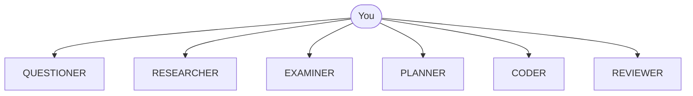

# Synaphex

[](https://github.com/cyhunblr/synaphex/actions/workflows/ci.yml)
[](#installation)
[](#installation)
[](LICENSE)

Synaphex is a local multi-agent framework for software work. It lets you
coordinate six specialised agents that run on AI provider runtimes you already
have installed — OpenAI Codex, Anthropic Claude Code, or Google Antigravity —
and it keeps their output under explicit, reviewable control.

You reach Synaphex through the [Model Context Protocol](https://modelcontextprotocol.io):
`synaphex install` registers a Synaphex MCP server with your provider's CLI, and
from then on you drive the workflow by talking to that provider.

[Why Synaphex](#why-synaphex) ·
[Core model](#core-model-you-are-the-orchestrator) ·
[Agents](#the-six-agents) ·
[Providers](#provider-support) ·
[Install](#installation) ·
[Quick start](#quick-start) ·
[Safety](#safety-model) ·
[Docs](#documentation) ·
[Limitations](#current-limitations-in-v01)

## Why Synaphex

A single general-purpose assistant tends to blur roles. It gathers context,
decides an approach, writes code, and assesses its own work in one continuous
motion — which makes it hard to tell what was verified and what was assumed.

Synaphex separates those roles and puts the transitions in your hands:

- **Roles are distinct.** The agent that plans is not the agent that implements,
  and the agent that reviews cannot quietly repair what it just criticised.
- **Implementation is staged, not applied.** Code changes land in an isolated
  workspace and become a change set you inspect before anything touches your
  repository.
- **Decisions are explicit.** Accepting a plan, applying a change set, and
  completing a task are deliberate operations, not inferences drawn from
  conversational agreement.
- **Providers stay independent.** An agent hosted by one provider can run on
  another's runtime, and credentials never pass through Synaphex.

## Core model: you are the orchestrator

Synaphex has no central orchestrator agent. Nothing decides on its own to run
QUESTIONER, then PLANNER, then CODER, then REVIEWER.

You choose each step. Synaphex enforces the rules that make each step safe:
whether a role may run at all, whether one agent may call another, and whether a
result is allowed to change durable state.

> **You are the orchestrator.** Synaphex does not choose the next agent for you.

Every agent is invoked directly by you. None of them hands off to another:



There is no orchestrator agent in that picture, and no arrow between agents.
You choose each step, in whatever order the work needs — skipping roles you do
not need and repeating ones you do.

An agent may *request* help from another agent. That request is classified
against your rules and either allowed, held for one-time approval, or denied —
it never executes automatically.

## The six agents

| Agent | Responsibility |
| --- | --- |
| `QUESTIONER` | Clarifies requirements and working context before work begins. |
| `RESEARCHER` | Investigates context and produces findings. Reads source; never writes it. |
| `EXAMINER` | The authority for canonical project and task memory. |
| `PLANNER` | Produces a plan draft. Does not implement. |
| `CODER` | Implements, in an isolated staging workspace, as a reviewable change set. |
| `REVIEWER` | Verifies applied work. Does not fix it. |

There is no seventh agent. Memory is a subsystem that EXAMINER governs, not an
agent of its own.

## Provider support

Two different questions matter here, and Synaphex answers them separately.

**Which provider can host Synaphex?** All three:

| MCP host | Runtime | Status |
| --- | --- | --- |
| OpenAI | `codex` | Supported |
| Anthropic | `claude` | Supported |
| Google | `agy` (Antigravity) | Supported |

Host identity is the **provider runtime only**. A provider's CLI and its VS Code
extension share one MCP registration, and Synaphex cannot tell which of them
launched it — so it does not claim to. It never infers the UI origin.

**Which provider can execute an agent?** A narrower set:

| Agent target | Status in v0.1 |
| --- | --- |
| `openai` / `cli` | Executable |
| `anthropic` / `cli` | Executable |
| `google` / `cli` | Recognised, but execution is unavailable and fails closed |
| any provider / `vscode` | Not supported; refused before execution |

These are independent. You can use Antigravity as your MCP host today while
Google remains unavailable as an agent execution target.

If Synaphex is launched from a provider's VS Code extension and an agent targets
that same provider's CLI, Synaphex runs the provider **CLI as a separate
process**. It does not reuse the interactive editor session.

## Installation

Requires Linux and Node.js 20 or newer.

```bash
npm install -g synaphex
synaphex install
```

`synaphex install` detects the provider runtimes you already have, asks which to
configure, shows you the plan, and registers the Synaphex MCP server only after
you confirm.

Synaphex does **not** install Codex, Claude Code, Antigravity, VS Code, or any
extension, and it does not authenticate them. Install and sign in to your
providers yourself, using their own instructions.

See [installation](docs/getting-started/installation.md) and
[first setup](docs/getting-started/first-setup.md) for detail.

## Quick start

After installation, you work through your provider. A first pass usually looks
like this:

1. Configure at least one agent in `~/.synaphex/agent_config.jsonc`.
2. Register your project and create a task.
3. Open a task session.
4. Invoke the role you need.
5. For coding work, inspect the resulting change set and apply or reject it.
6. Complete the task, then archive it.

[First workflow](docs/getting-started/first-workflow.md) walks through this end
to end with the exact operations.

## Safety model

The guarantees that shape day-to-day use:

- **CODER never edits your repository during execution.** It works in an
  isolated Git clone taken at your current `HEAD`, and its output becomes a
  durable change set.
- **Applying a change set is explicit and exact.** Apply requires your source to
  still match the recorded baseline, reproduces the reviewed result precisely,
  and leaves the changes **staged**. Synaphex never commits, pushes, or merges.
- **A plan draft is not an accepted plan.** Acceptance is a distinct operation
  bound to an exact draft revision. Saying "looks good" in chat grants no
  authority.
- **REVIEWER verifies; it does not repair.** A failing review does not trigger
  CODER. You decide what happens next.
- **Agent-to-agent calls are rule controlled**, resolved as
  `task > project > global > default deny`.
- **No generic filesystem or shell tool is exposed over MCP.** Every tool is a
  specific Synaphex domain operation.
- **Credentials stay with your providers.** Synaphex never stores, reads, or
  transmits them.

## Documentation

**[Documentation home](docs/README.md)** — the full map, with reading paths for
new users, provider setup, security review, and maintainers.

Straight to the useful parts:

- [Installation](docs/getting-started/installation.md) — install and register
- [First workflow](docs/getting-started/first-workflow.md) — a real task, end to end
- [Troubleshooting](docs/troubleshooting/installation.md) — when something refuses
- [Security model](docs/security/security-model.md) — what is and is not guaranteed
- [Compatibility](docs/reference/compatibility.md) — canonical support matrix

## Current limitations in v0.1

These are deliberate support boundaries, stated plainly so you can judge fit:

- **Linux only.** Verified on Node.js 20 and 22. macOS and Windows are not
  supported.
- **VS Code is not an executable agent target.** Configuring one is refused
  before execution rather than quietly redirected to a CLI.
- **Google is a host, not yet a target.** Antigravity can host Synaphex; agent
  execution on `google` currently fails closed.
- **CODER requires a clean Git worktree**, and applying a change set leaves the
  result staged. Running CODER again after an apply may need you to commit or
  otherwise settle the worktree first.
- **`git_push` and `ci` are classified but not executed.** Synaphex recognises
  these requests and applies rules to them; it performs neither.
- **Synaphex is an application, not a Node SDK.** The npm package ships two
  binaries and an MCP server. Importing `synaphex` in code is not supported.

## License

Apache License 2.0. See [LICENSE](LICENSE).
