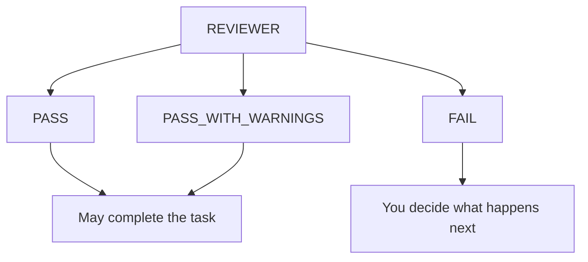

# Agents

Synaphex defines exactly six logical agents. The set is fixed: there is no
seventh agent, and memory is a subsystem rather than a role.

Each agent is a **role contract** — a boundary defined in code that neither
configuration nor rules can widen. See [the Synaphex model](synaphex-model.md)
for how a role relates to the provider and model that execute it.

## At a glance

| Agent | Purpose | Source access | Primary output | May write canonical memory? | May implement? |
| --- | --- | --- | --- | --- | --- |
| `QUESTIONER` | Clarify requirements and context | Read-only | Working context | No | No |
| `RESEARCHER` | Investigate and gather evidence | Read-only | Research artifact | No | No |
| `EXAMINER` | Curate canonical memory | Read-only | Memory intent | **Yes — sole authority** | No |
| `PLANNER` | Produce a plan | Read-only | Plan draft | No | No |
| `CODER` | Implement | Staged clone only | Change set | No | **Yes** |
| `REVIEWER` | Verify applied work | Read-only | Review report | No | No |

Only CODER implements. Only EXAMINER curates canonical memory. No agent does
both.

---

## QUESTIONER

Clarifies what the work actually requires, before anyone plans or builds it.

**May** ask focused questions about requirements and working context, and record
the resulting context against the task.

**Must not** produce a plan, or implement anything.

**Typical output** is working context: the answers and constraints that later
roles depend on.

Its output is **raw context, not canonical memory**. Recording something here
does not make it part of the project's curated knowledge — see
[memory](memory.md).

**Lifecycle:** task-bound, and requires an active task.

---

## RESEARCHER

Investigates questions the work depends on and returns evidence.

**May** read project source and produce findings with their sources.

**Must not** modify project source, or write canonical memory directly.

**Typical output** is a research artifact: `findings`, `sources`, `evidence`,
`uncertainties`, `conflicts`, `open_questions`.

**Lifecycle:** may run task-bound or project-scoped, and may legally run against
a **completed** task — useful when you want to understand finished work.

---

## EXAMINER

The authority for canonical memory. No other role may change it.

**May** examine project and task context, load existing memory into a session,
and request canonical memory changes — replacing or clearing project or task
memory.

**Must not** modify project source, or implement anything.

**Typical output** is a memory intent, and where relevant a memory conflict.

> **EXAMINER surfaces conflicts rather than overwriting.** When new information
> contradicts existing canonical memory, it reports the conflict and leaves the
> existing memory in place.

EXAMINER is not REVIEWER. EXAMINER curates what the project *knows*; REVIEWER
verifies what was *built*.

**Lifecycle:** may run task-bound or project-scoped, and may legally run against
a completed task.

---

## PLANNER

Produces a plan for the work. Nothing more.

**May** analyse the task and produce a plan draft.

**Must not** implement, and **must never call CODER** — that edge is an
immutable prohibition, not a rule you can change.

**Typical output** is a plan draft.

A draft carries no authority on its own. It becomes authoritative only through
explicit, revision-bound acceptance — see [plans](plans.md).

**Lifecycle:** task-bound, and requires an active task.

---

## CODER

The only role that implements.

**May** implement the work and request clarification from PLANNER for a
restricted set of purposes: plan clarification, implementation deviation, or
plan revision.

**Must not** edit the registered source during execution, and **must never call
REVIEWER** — another immutable prohibition, so implementation can never approve
itself.

**How it works:** a task-bound CODER always runs in an isolated staging clone,
never in your repository. Its result becomes a durable **change set** you apply
or reject explicitly.

**Typical output** is `files_changed`, `commands_run`, `tests_run`,
`implementation_decisions`, `plan_deviations`, `errors`, `remaining_concerns`.

**Plan interaction:** an accepted plan is authoritative. A *pending* draft blocks
CODER entirely — decide the plan first.

**Lifecycle:** task-bound, and requires an active task.

---

## REVIEWER

Verifies work that has actually been applied.

**May** read source and evidence, and report an outcome.

**Must not** fix anything. A reviewer that repaired what it criticised would
make the review meaningless.

**Outcomes:**

| Outcome | Meaning |
| --- | --- |
| `PASS` | Acceptable. May complete the task. |
| `PASS_WITH_WARNINGS` | Acceptable, with recorded concerns. May complete the task. |
| `FAIL` | Not acceptable. |



A `FAIL` does not invoke CODER, and nothing retries automatically.

**Typical output** is `requirement_compliance`, `plan_compliance`,
`implementation_quality`, `validation_results`, `warnings`, `recommendations`,
`technical_debt`.

**Lifecycle:** task-bound, requires an active task, and requires that your
source actually reflects the applied change set.

---

## Agents calling agents

An agent may *request* help from another. That request is classified against
your rules and is allowed, held for one-time approval, or denied. It never runs
automatically.

Two edges are **immutable prohibitions** that no rule can enable:

```text
PLANNER → CODER      planning may not trigger implementation
CODER   → REVIEWER   implementation may not approve itself
```

See [rules and permissions](rules-and-permissions.md) for how the configurable
edges are decided.

## Next

- [Projects, tasks and sessions](projects-tasks-sessions.md)
- [Memory](memory.md) — how EXAMINER's authority works.
- Previous: [the Synaphex model](synaphex-model.md)
