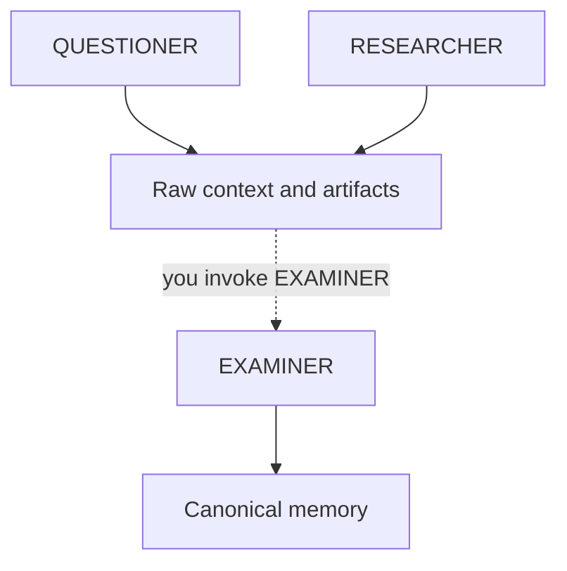

# Memory

Memory is a Synaphex **subsystem**, not an agent. It holds curated knowledge
about a project or task that survives beyond a single invocation.

Memory is not chat history, and it is not an automatic record of everything an
agent produced.

## Raw context versus canonical memory

The distinction that makes memory trustworthy:

| | Raw context and artifacts | Canonical memory |
| --- | --- | --- |
| Produced by | QUESTIONER, RESEARCHER, CODER, REVIEWER | EXAMINER only |
| Status | Evidence, as reported | Curated knowledge |
| Created automatically? | Yes, as invocation output | **No** |
| Contradicts existing memory? | Recorded as-is | Surfaced as a conflict |

An agent producing a finding does not make that finding canonical. Findings are
evidence; canonical memory is what the project has decided is true.

The dotted edge matters: nothing promotes evidence into canonical memory on its
own. EXAMINER runs because you invoked it, or because a helper request was
explicitly permitted by your rules.

## EXAMINER is the only writer

Only EXAMINER may change canonical memory. It can replace or clear memory at
either scope, and no other role carries that ability — not even indirectly.

> **Conflicting information does not silently replace canonical memory.** When
> new information contradicts what is already recorded, EXAMINER surfaces the
> conflict and leaves the existing memory intact until you resolve it.

That is the whole point of routing memory through one role. Six agents writing
freely would give you an accumulating record with no idea which parts were ever
reconciled.

## Scopes

Canonical memory exists at two scopes:

| Scope | Holds | Lifetime |
| --- | --- | --- |
| **Project memory** | Knowledge about the project as a whole | Beyond any single task |
| **Task memory** | Knowledge specific to one task | Tied to that task |

Memory from one scope can be **loaded** into a session so an agent can use it,
which is a read operation and changes nothing.

Archiving a task preserves its memory. Nothing is discarded.

## What memory is not

- **Not chat history.** Provider conversations are not memory.
- **Not automatic.** Producing output does not record anything canonical.
- **Not a seventh agent.** It is state that EXAMINER governs.
- **Not implicitly trusted research.** A RESEARCHER finding is evidence until
  EXAMINER curates it.

## Next

- [Plans](plans.md)
- [Rules and permissions](rules-and-permissions.md)
- Previous: [projects, tasks and sessions](projects-tasks-sessions.md)
