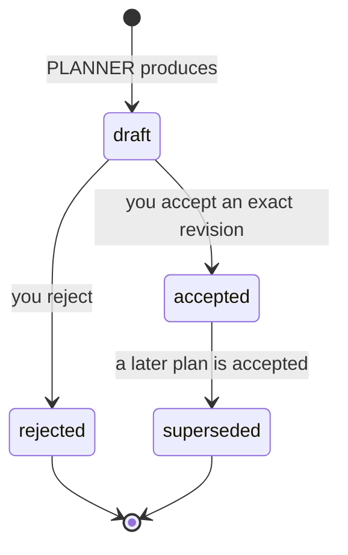

# Plans

A plan is how you agree what CODER should build before it builds it. The
important idea is that agreement must be **explicit**.

## Draft versus accepted plan

PLANNER produces a **plan draft**. A draft is a proposal and carries no
authority.

Only an **accepted plan** is authoritative for CODER.

> **A plan draft is not an accepted plan.** Saying "looks good" in conversation
> grants no authority. Acceptance is a distinct operation.

## Revision identity

Every draft carries a revision identity. Accepting a plan means accepting **that
exact revision**, not "the current draft".

This matters because a draft can change between the moment you read it and the
moment you accept it. Binding acceptance to a revision means:

- **Stale approval is refused.** If the draft was rewritten after you read it,
  your acceptance no longer applies and is rejected.
- **Identical content does not inherit approval.** A replacement draft is a new
  revision even if its text is unchanged, so it needs its own acceptance.

You never compute or track revisions yourself. You read a draft, you get its
revision, and you accept that one.

## How plans affect CODER

| Plan state | Effect on CODER |
| --- | --- |
| No plan at all | May act within its role contract and your rules |
| **Pending draft** | **Blocked** — decide the plan first |
| Accepted plan | The accepted plan is authoritative |
| Rejected draft | No authority; as if no plan existed |
| Superseded plan | Archived; the newer accepted plan applies |

A pending draft blocks CODER deliberately. Without that, implementation could
race a plan you had not finished deciding on, and neither result would be
trustworthy.

## PLANNER does not start CODER

Producing a plan never triggers implementation. `PLANNER → CODER` is an
immutable prohibition in the role contracts — not a rule you can enable.

The reverse edge exists but is narrow: CODER may consult PLANNER for plan
clarification, implementation deviation, or plan revision. Even then it is a
*request*, subject to your rules, and a revised plan needs fresh acceptance
before it carries authority.

## Next

- [Rules and permissions](rules-and-permissions.md)
- [Providers and routing](providers-and-routing.md)
- Previous: [memory](memory.md)
