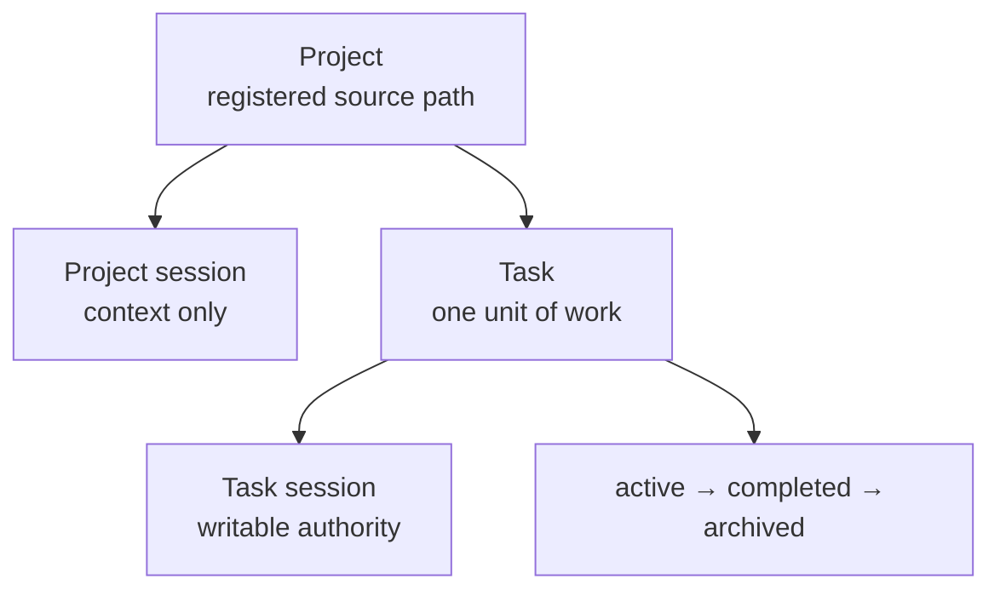
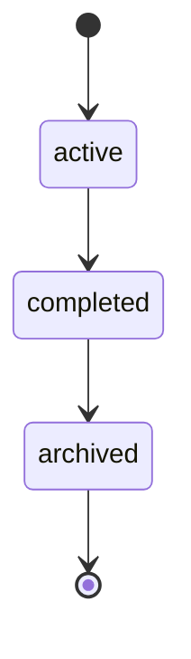

# Projects, tasks and sessions

These three concepts define *where* work happens, *what* the work is, and *who
currently holds authority over it*.

A project session gives you project context. A **task session** is the one that
carries writable authority over a task.

## Project

A project is a registered path to source you already have, plus the Synaphex
state that belongs to it.

Registering a project does not create, clone, or modify a repository. Synaphex
records where your source lives; it does not take ownership of it.

## Task

A task is one unit of work inside a project, with a one-way lifecycle:

There is **no reopen and no unarchive**. Work that continues after archiving is
a new task.

## Session

A session is a provider-neutral Synaphex binding — your handle on a project or
a task.

A session is explicitly **not**:

- a provider conversation or thread;
- a process id;
- an MCP connection.

That independence is deliberate. Your provider conversation can end, reconnect,
or move to a different machine without changing what Synaphex considers bound.

### Two kinds of session

| | Project session | Task session |
| --- | --- | --- |
| Scope | A project | One task in a project |
| Writable task authority | No | **Yes** |
| Roles that can run | Those permitting project scope, such as RESEARCHER and EXAMINER | Task-bound roles |
| Concurrency | Several may exist | At most one at a time per task |

**A task has at most one writable session at a time.** If another session holds
it, your operations are refused rather than silently taking over.

### Losing authority

If your session loses ownership while an agent is still running — because the
session was closed, or ownership was released and taken elsewhere — the result
**cannot commit**. Nothing it produced is written.

That check happens at the point of writing, not only before execution starts, so
a long-running invocation cannot land results against a task it no longer owns.

## Completion is not archival

These are two distinct steps, and conflating them causes confusion.

| | Complete | Archive |
| --- | --- | --- |
| Meaning | The work is done | The task is closed out |
| Task session | **Retained** | Released |
| Task ownership | **Retained** | Released |
| Reversible | No | No |
| History | Preserved | Preserved |

**Completion** marks the work semantically finished. Your session and ownership
remain, so roles whose contracts permit a completed task — RESEARCHER and
EXAMINER — can still run against it.

Completion is refused while a plan draft is still pending or a change set is
still undecided, so nothing is left dangling.

**Archiving** is explicit and terminal. It releases the task session and
ownership, and preserves everything: plans, artifacts, change sets, decisions,
review history, and memory. Archiving deletes nothing.

Because archiving takes a project and task rather than a session, a completed
task whose session is long gone can still be archived.

## Next

- [Memory](memory.md)
- [Plans](plans.md)
- Previous: [agents](agents.md)
