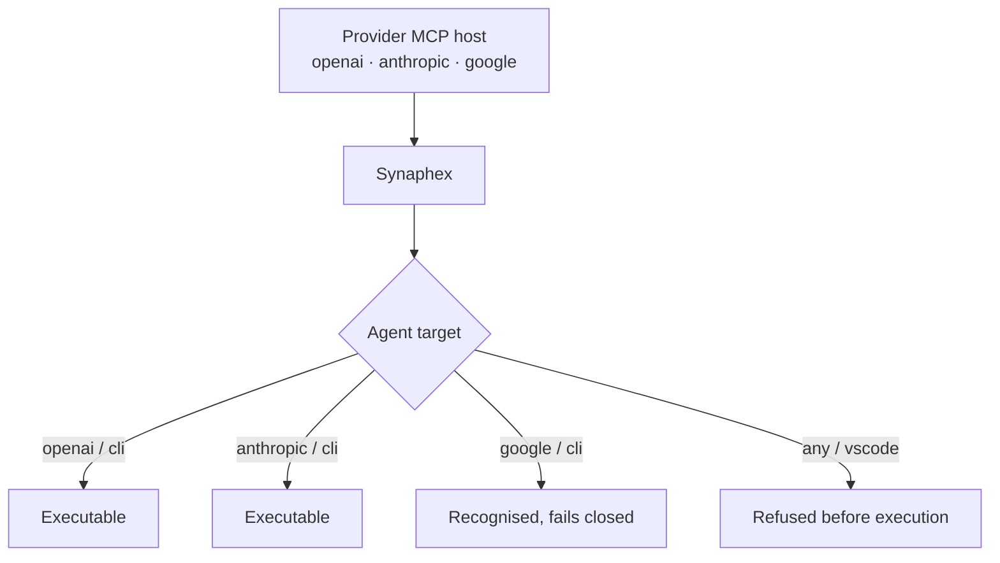

# Providers and routing

Four concepts are easy to conflate and mean different things:

| Concept | Question it answers |
| --- | --- |
| **Provider** | Which vendor's runtime is involved? |
| **Host surface** | Which interactive surface can host Synaphex over MCP? |
| **MCP registration observation** | Does Synaphex's manifest record host setup? |
| **Execution target** | Which independently launched runtime executes an agent? |

Your MCP host and your agent target are set independently. An Anthropic host
can run an agent on OpenAI, and often will.



## Providers

| Provider | Runtime | Command |
| --- | --- | --- |
| OpenAI | Codex CLI | `codex` |
| Anthropic | Claude Code CLI | `claude` |
| Google | Antigravity | `agy` |

Gemini CLI is not supported. Google means Antigravity.

## MCP host identity is provider-only

The host is identified by **provider alone**:

```text
McpHostContext { provider }
```

There is no surface field, and that is deliberate. A provider's CLI and its VS
Code extension **share one MCP registration**, so a server launched by the
extension is the same registration the CLI uses. Synaphex therefore does not
infer — and never claims to know — whether a CLI, a VS Code extension, an
Electron process, or a parent process launched it.

> Synaphex asserts only what it can verify. Provider-only host identity stays
> truthful no matter which UI started the server.

This is a trust-model property, not a missing feature. Claiming a surface it
cannot observe would put an unverifiable assertion at the centre of routing.

## Execution target identity

An agent's target is separate, and richer:

```text
provider  +  execution surface  +  model  +  optional settings
```

The internal target IDs are `codex_cli`, `claude_code_cli`, and
`antigravity_cli`; the first two are supported and the last is unavailable.
The persisted v0.1 shape remains unchanged and uses `surface: "cli"` for newly
authored callable targets. A historical target configured with
`surface: vscode` is **refused before execution** — it is not quietly redirected
to a CLI, because running something you did not configure would be worse than
refusing.

If Synaphex was launched from a provider's VS Code extension and an agent
targets that same provider's CLI, Synaphex launches the provider **CLI as a
separate process**. It does not reuse the interactive editor session.

## Route matrix

| Host provider | Target provider | Surface | Result |
| --- | --- | --- | --- |
| X | X | `cli` | Same-provider configured CLI |
| X | Y | `cli` | Cross-provider CLI |
| any | any | `vscode` | Refused before execution |

Every executable route in v0.1 runs a provider CLI.

MCP registration is not a prerequisite for target execution. Registration
describes whether a provider host can launch Synaphex; target readiness combines
the static product authority with that target runtime's installation probe.

## Provider capability matrix

| Provider | MCP host | Agent target | Notes |
| --- | --- | --- | --- |
| OpenAI | Yes | Yes (`cli`) | Executable |
| Anthropic | Yes | Yes (`cli`) | Executable |
| Google / Antigravity | Yes | **Not currently** | Recognised as a target, but execution fails closed |

Read that last row carefully: Antigravity is a fully supported **host**. You can
use Synaphex from Antigravity today. It is not currently usable as an **agent
target**.

### Why Google execution fails closed

When Synaphex runs an agent, it asks the provider runtime to enforce an
execution policy for that invocation — what the agent may modify, and whether
it may reach the network.

OpenAI and Anthropic runtimes expose controls that let Synaphex enforce the
requested policy for a single invocation. Antigravity currently does not expose
an equivalent invocation-scoped mechanism.

Synaphex fails closed rather than running an agent whose policy it cannot
enforce. The alternative would be to claim a guarantee it cannot deliver — a
worse outcome than an honest refusal.

## Model authority

Executable models come from a static, versioned, offline catalog. Runtime or
account observations cannot widen it. Recommended and supported entries are
both executable; the tier is product guidance. Unknown historical values remain
readable and unchanged but cannot run, and new unknown values are rejected.
See [validated model catalog](../reference/model-catalog.md).

## Authentication

Synaphex does not store, read, or manage provider credentials. Authentication
belongs entirely to your provider runtimes, and no Synaphex configuration file
has a field for a credential.

Sign in to each provider using its own mechanism before expecting agent
execution to work.

## The network capability

`network` is a **provider capability**, not generic networking. Requesting it
asks the provider runtime to permit network access for that invocation, subject
to your rules — see [rules and permissions](rules-and-permissions.md).

It does not grant an agent unrestricted outbound access from arbitrary
subprocesses.

## Next

- Back to [the Synaphex model](synaphex-model.md)
- [First workflow](../getting-started/first-workflow.md)
- Previous: [rules and permissions](rules-and-permissions.md)
