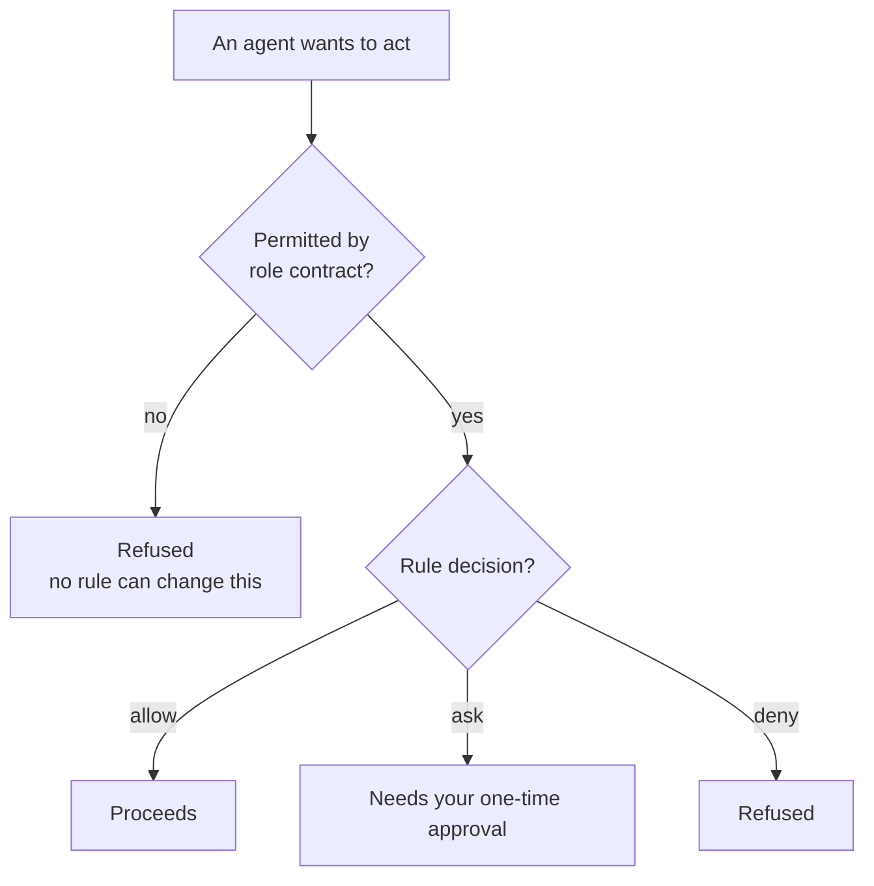

# Rules and permissions

Two different mechanisms decide whether something may happen. Keeping them
apart is essential.

> **Role contracts define what an agent can ever do. Rules control whether an
> otherwise-valid action is allowed, denied, or needs approval.**
>
> **Rules can restrict a role. They cannot widen one.**



A rule saying `allow` on something the role contract forbids changes nothing.
The contract is checked first, and it is fixed in code.

## Precedence

Rules resolve most-specific-first:

```text
task  >  project  >  global  >  default deny
```

| Level | Applies to |
| --- | --- |
| Task | One task |
| Project | All tasks in a project |
| Global | Everything, from `~/.synaphex/rules.jsonc` |
| Default deny | Anything no rule matched |

**Anything unmatched is denied.** Permissions are opt-in, so a rule you forgot
to write fails closed rather than open.

## Decisions

| Decision | Meaning |
| --- | --- |
| `allow` | Proceeds without asking |
| `ask` | Requires your explicit approval, once, for that occurrence |
| `deny` | Refused |

An `ask` approval is a **one-time grant**. Approving something does not edit
your rules or create a standing permission — the next occurrence asks again.

## Agent-to-agent permissions

An agent may request help from another. Those requests are rule controlled, and
Synaphex ships defaults that are deliberately conservative:

| Caller | Target | Default |
| --- | --- | --- |
| QUESTIONER | EXAMINER | `allow` |
| QUESTIONER | RESEARCHER | `ask` |
| RESEARCHER | EXAMINER | `ask` |
| EXAMINER | RESEARCHER | `ask` |
| PLANNER | EXAMINER, RESEARCHER, QUESTIONER | `ask` |
| **PLANNER** | **CODER** | **`deny`** |
| CODER | PLANNER | `allow` |
| CODER | RESEARCHER, QUESTIONER | `ask` |
| **CODER** | **REVIEWER** | **`deny`** |
| REVIEWER | EXAMINER, RESEARCHER, PLANNER, CODER | `ask` |

Anything absent from that table is denied by default.

### Configurable versus immutable

The two `deny` rows above are special. `PLANNER → CODER` and
`CODER → REVIEWER` are **immutable prohibitions** in the role contracts, not
merely conservative defaults:

```text
configurable   an `ask` edge you may set to allow or deny
immutable      planning may not trigger implementation
               implementation may not approve itself
```

Editing a rule to `allow` on an immutable edge does not enable it. The role
contract refuses first.

The `CODER → PLANNER` edge is allowed by default but **purpose-restricted**: it
is limited to plan clarification, implementation deviation, or plan revision.

## Action permissions

Actions are separate from agent calls:

| Action | Type | v0.1 execution |
| --- | --- | --- |
| `network` | Provider capability | Supported, through allow or one-time approval |
| `git_push` | Host action | Classified, **not executed** |
| `ci` | Host action | Classified, **not executed** |

All three default to `ask`.

`network` is a **provider capability**: it asks the provider runtime to permit
network access for that invocation. It is not generic subprocess networking.

`git_push` and `ci` are recognised and rule-checked, but Synaphex performs
neither in v0.1. A request is classified and reported; nothing runs.

> The `ci` action means an agent asking to run CI. It is unrelated to the GitHub
> Actions workflows in this repository.

## Next

- [Providers and routing](providers-and-routing.md)
- Previous: [plans](plans.md)
