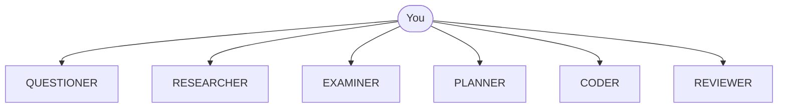

# The Synaphex model

Synaphex coordinates six specialised **logical agents** that run on AI provider
runtimes you already have. This page establishes the mental model the rest of
the documentation assumes.

## You are the orchestrator

Synaphex has no orchestrator agent. Nothing inside it decides which role runs
next, and finishing one role never starts another.



Every arrow starts at you. There is no arrow between agents, and no box in the
middle deciding on your behalf.

> **You are the orchestrator.** Synaphex enforces what is *allowed* at each
> step; it never chooses the step.

## What Synaphex provides

Synaphex is the layer that makes delegating work to a model reviewable:

| Synaphex provides | Meaning |
| --- | --- |
| **Role contracts** | Fixed boundaries per agent. Not configurable. |
| **Provider routing** | Which runtime executes a given agent. |
| **Project, task and session state** | Durable scope and ownership. |
| **Memory** | Curated project and task knowledge. |
| **Plan authority** | Explicit, revision-bound plan acceptance. |
| **Permissions** | Configurable rules over agent calls and actions. |
| **Change-set authority** | Implementation you review before it lands. |
| **Lifecycle management** | `active → completed → archived`. |

What it does not provide is autonomy. It will not run a workflow end to end
because you described a goal.

## Possible paths, not a pipeline

A full path exists, and it is a reasonable default:

```text
QUESTIONER → PLANNER → accept plan → CODER → apply change set → REVIEWER
```

But it is one path you may choose, not a required sequence. These are equally
valid when role contracts, rules and task state permit them:

```text
RESEARCHER
RESEARCHER → EXAMINER
CODER                    (when no plan draft is pending)
```

You pick each step. Synaphex decides only whether that step is currently
allowed.

## A logical agent is not a model

This distinction matters more than any other on this page.

`PLANNER` is a **Synaphex role contract**. It is not a synonym for Claude,
Codex, GPT, or Antigravity. Those are provider runtimes and models that a role
may be configured to run on.

```text
PLANNER  =  role contract          (fixed, defined by Synaphex)
          + provider               (openai | anthropic | google)
          + execution surface      (cli in v0.1)
          + model                  (you choose; required)
          + optional settings
```

Configuring a role changes **who executes it**, never **what it may do**:

| Changing this | Changes what the agent may do? |
| --- | --- |
| Provider | No |
| Model | No |
| Settings | No |
| Rules | Can restrict further; never widen |
| Role contract | Fixed in code; not configurable |

Pointing PLANNER at a more capable model does not let it implement code. The
role contract is the boundary, and nothing in configuration reaches past it.

## What Synaphex is not

- **Not an autonomous agent swarm.** No agent triggers another on its own.
- **Not a provider replacement.** It uses runtimes you install and sign in to.
- **Not a credential store.** Authentication stays with your providers.
- **Not a Node SDK.** The npm package ships two binaries and an MCP server.

## Next

- [Agents](agents.md) — the six role contracts in detail.
- [Projects, tasks and sessions](projects-tasks-sessions.md)
- Back to [first workflow](../getting-started/first-workflow.md)
