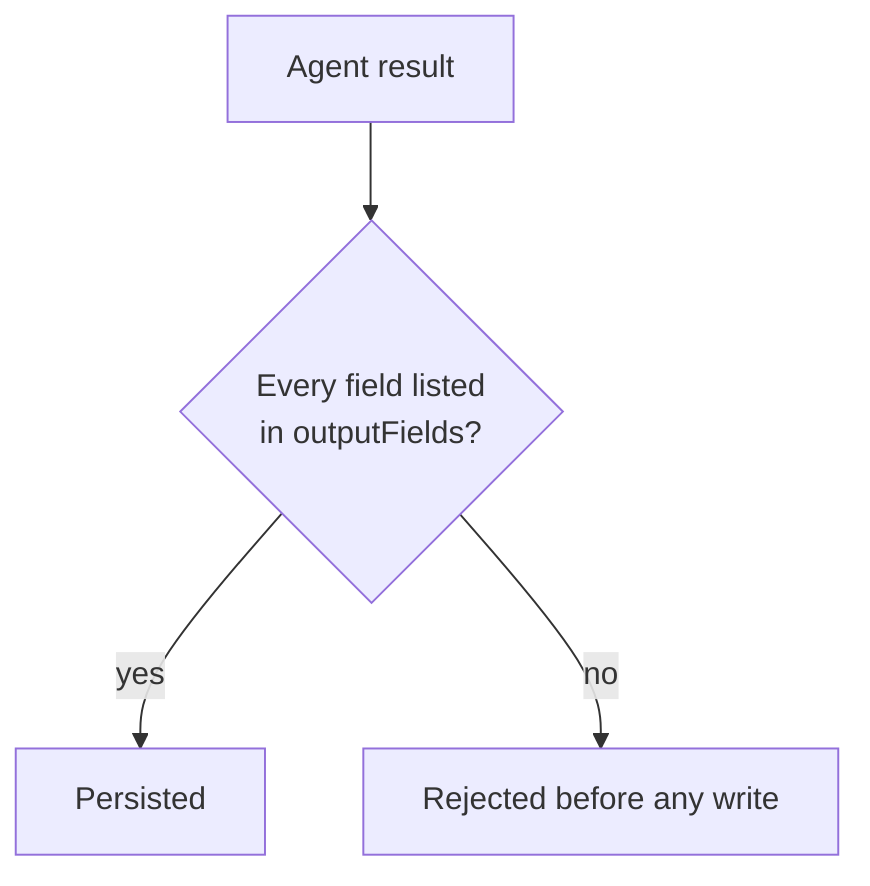

# Agent behavior

`~/.synaphex/agent_behavior.jsonc` controls **which output fields an agent may
persist**. It is the narrowest of the three configuration files, and it does
exactly one thing.

## Only three agents have behavior entries

```jsonc
{
  "version": 1,
  "behaviors": {
    "researcher": { "outputFields": ["findings", "sources", "evidence", "uncertainties", "conflicts", "open_questions"] },
    "coder": { "outputFields": ["files_changed", "commands_run", "tests_run", "implementation_decisions", "plan_deviations", "errors", "remaining_concerns"] },
    "reviewer": { "outputFields": ["requirement_compliance", "plan_compliance", "implementation_quality", "validation_results", "warnings", "recommendations", "technical_debt"] }
  }
}
```

QUESTIONER, EXAMINER and PLANNER have no entries here. Their results are shaped
by their role contracts rather than by a configurable field list.

## Default output fields

| Agent | Default `outputFields` |
| --- | --- |
| `researcher` | `findings`, `sources`, `evidence`, `uncertainties`, `conflicts`, `open_questions` |
| `coder` | `files_changed`, `commands_run`, `tests_run`, `implementation_decisions`, `plan_deviations`, `errors`, `remaining_concerns` |
| `reviewer` | `requirement_compliance`, `plan_compliance`, `implementation_quality`, `validation_results`, `warnings`, `recommendations`, `technical_debt` |

## What `outputFields` does

A result carrying a field that is **not** in the list is rejected before
anything is written. So the list is a ceiling on what the agent may record.



## What it does not do

Narrowing this list changes what is **persisted**, not how the provider thinks
or what it returns. It is a validation boundary on recorded results, not a
prompt or model setting.

It also cannot grant anything:

| `outputFields` cannot | Because |
| --- | --- |
| Widen a role contract | Contracts are fixed in code |
| Give an agent source-write authority | Only CODER implements, through staging |
| Give an agent canonical-memory authority | Only EXAMINER curates memory |
| Change plan or lifecycle constraints | Those are enforced independently |

> `outputFields` can only make an agent record **less**. Nothing here makes an
> agent able to do more.

## Narrowing an example

To keep RESEARCHER results terse, list only the fields you want retained:

```jsonc
{
  "version": 1,
  "behaviors": {
    "researcher": {
      "outputFields": ["findings", "sources"]
    }
  }
}
```

With that in place, a RESEARCHER result containing `uncertainties` is rejected
rather than trimmed. Be deliberate: `uncertainties` and `conflicts` are often
the most useful part of a research result, and removing them means you no longer
see when the evidence disagreed.

## Next

- [Rules](rules.md)
- Related: [agents](../concepts/agents.md)
- Previous: [agent configuration](agent-config.md)
