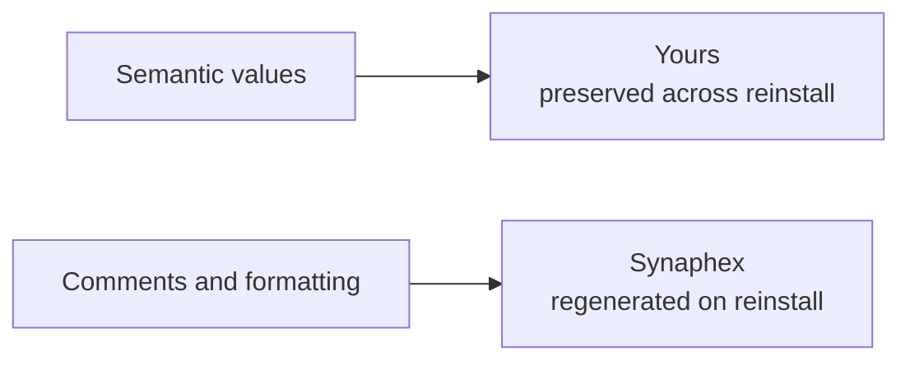

# Configuration overview

Synaphex keeps three configuration files in `~/.synaphex`:

```text
~/.synaphex/
├── agent_config.jsonc     where each agent runs
├── agent_behavior.jsonc   what each agent may persist
└── rules.jsonc            which calls and actions are permitted
```

| File | Controls | Edit it when | Reinstall |
| --- | --- | --- | --- |
| [`agent_config.jsonc`](agent-config.md) | Provider and model per agent | Assigning or changing where an agent runs | Values kept, comments refreshed |
| [`agent_behavior.jsonc`](agent-behavior.md) | Allowed output fields per agent | Narrowing what an agent may record | Values kept, comments refreshed |
| [`rules.jsonc`](rules.md) | Agent-call and action permissions | Loosening or tightening approvals | Values kept, comments refreshed |

All three are JSONC — JSON with comments.

## What configuration does not control

Some things are deliberately outside your configuration:

| Not configurable | Why |
| --- | --- |
| Role contracts | Fixed in code. Rules can restrict a role, never widen one. |
| Provider credentials | Authentication belongs to your provider runtimes. |
| MCP host identity | Determined by the registration the installer writes. |
| Task lifecycle | `active → completed → archived`, driven by operations rather than settings. |
| Provider model discovery | The supported catalog is static, offline and versioned with Synaphex. |

There is no credential field in any Synaphex configuration file, and no setting
that grants an agent a capability its role contract does not already permit.

## Who owns what

Ownership is split, and knowing which half is yours prevents surprises:



Running `synaphex install` again re-renders each file:

```text
parse existing file
  → validate values
    → keep your values exactly
      → render current canonical comments
        → write
```

The practical consequences:

- Your values survive untouched.
- Comments, key order and indentation may change.
- **Comments you add yourself are not preserved.**

That trade keeps the explanatory comments accurate as Synaphex changes, instead
of leaving stale guidance in place forever.

## Invalid configuration fails closed

If a file cannot be used, Synaphex refuses and **leaves your bytes exactly as
they are**:

| Problem | Example |
| --- | --- |
| Invalid syntax | A missing brace or bad JSONC |
| Wrong version | A `version` other than `1` |
| Unknown field | A key Synaphex does not recognise |
| Unknown agent | An agent name that does not exist |
| Missing model | A configured agent with no `model` |
| Unsupported model/setting | A model outside the provider/surface catalog, or a setting outside that model's schema |

> **Synaphex never repairs a broken config by overwriting it with defaults.**
> It reports the problem and leaves the file alone, because replacing it would
> destroy work you meant to keep.

Provider registrations that already succeeded are unaffected; the configuration
problem is reported on its own line.

## Unknown fields are rejected

An unrecognised key is refused rather than ignored.

> Canonical regeneration re-renders each file from the values it parsed. A field
> Synaphex did not understand would silently vanish on the next reinstall —
> so it refuses up front and tells you instead.

## Next

- [Agent configuration](agent-config.md)
- [Agent behavior](agent-behavior.md)
- [Rules](rules.md)
- Related: [first setup](../getting-started/first-setup.md)

## Editing configuration visually

`synaphex configure` opens a local browser GUI over these same files, with the
agent hex, supported model selector, model-specific setting controls, rule
scopes and effective-decision inspector. Its catalog and validation come from
one backend registry; the React application owns no separate model list. It
uses the same atomic writes as the CLI, and these files stay canonical. See the
[configure guide](configure-gui.md).
