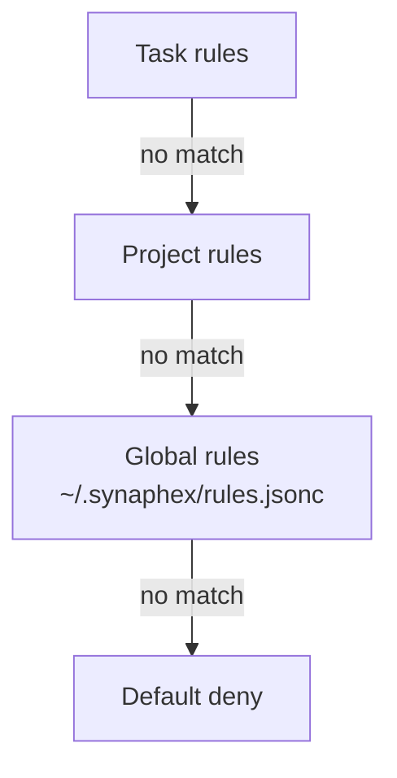

# Rules

`~/.synaphex/rules.jsonc` controls which agent-to-agent calls and which actions
are permitted. This page is the canonical reference for the schema and the
shipped defaults; see [rules and permissions](../concepts/rules-and-permissions.md)
for the model behind them.

## Structure

```jsonc
{
  "agent_calls": {
    "questioner": {
      "examiner": "allow",
      "researcher": "ask"
    }
  },
  "actions": {
    "network": "ask",
    "git_push": "ask",
    "ci": "ask"
  }
}
```

Two top-level keys, both optional: `agent_calls` maps caller → callee →
decision, and `actions` maps action → decision.

## Decisions

| Decision | Meaning |
| --- | --- |
| `allow` | Proceeds without asking |
| `ask` | Requires your explicit approval for that occurrence |
| `deny` | Refused |

An `ask` approval is **one-time**. Approving a call does not rewrite your rules
or create a standing grant — the next occurrence asks again.

## Precedence



```text
task  >  project  >  global  >  default deny
```

The most specific matching rule wins. **Anything unmatched is denied**, so
permissions are opt-in and a rule you forgot to write fails closed.

## Default agent-call rules

These are the defaults a fresh install writes:

| Caller | Callee | Default | Notes |
| --- | --- | --- | --- |
| `questioner` | `examiner` | `allow` | |
| `questioner` | `researcher` | `ask` | |
| `researcher` | `examiner` | `ask` | |
| `examiner` | `researcher` | `ask` | |
| `planner` | `examiner` | `ask` | |
| `planner` | `researcher` | `ask` | |
| `planner` | `questioner` | `ask` | |
| `planner` | `coder` | `deny` | **Immutable** — see below |
| `coder` | `planner` | `allow` | Purpose-restricted |
| `coder` | `researcher` | `ask` | |
| `coder` | `questioner` | `ask` | |
| `coder` | `reviewer` | `deny` | **Immutable** — see below |
| `reviewer` | `examiner` | `ask` | |
| `reviewer` | `researcher` | `ask` | |
| `reviewer` | `planner` | `ask` | |
| `reviewer` | `coder` | `ask` | |

Any pair not listed is denied by default.

## Immutable edges

Two of those `deny` rows are not merely conservative defaults — they are
prohibitions in the role contracts:

```text
planner → coder     planning may not trigger implementation
coder   → reviewer  implementation may not approve itself
```

> **Setting an immutable edge to `allow` does not enable it.** The role contract
> is checked before any rule, and refuses first.

The `coder → planner` edge is allowed by default but **purpose-restricted**: it
is limited to plan clarification, implementation deviation, or plan revision. A
request outside those purposes is refused regardless of this rule.

## Action rules

| Action | Category | Default | Executable in v0.1? |
| --- | --- | --- | --- |
| `network` | Provider capability | `ask` | **Yes**, through allow or one-time approval |
| `git_push` | Host action | `ask` | No — classified, never executed |
| `ci` | Host action | `ask` | No — classified, never executed |

`network` asks the provider runtime to permit network access for that
invocation. It is not generic subprocess networking.

`git_push` and `ci` are recognised and rule-checked, but Synaphex performs
neither in v0.1. A request is classified and reported; nothing runs.

> The `ci` action is an agent asking to run CI. It has nothing to do with the
> GitHub Actions workflows in this repository.

## Examples

### Require approval before research reaches memory

```jsonc
{
  "agent_calls": {
    "researcher": {
      "examiner": "ask"
    }
  }
}
```

### Allow network without prompting

```jsonc
{
  "actions": {
    "network": "allow"
  }
}
```

### Deny network entirely

```jsonc
{
  "actions": {
    "network": "deny"
  }
}
```

### A rule that has no effect

```jsonc
// This does NOT enable the call. The role contract refuses first.
{
  "agent_calls": {
    "planner": {
      "coder": "allow"
    }
  }
}
```

The file is valid and the value is stored, but `planner → coder` remains
refused. Rules restrict; they never widen.

## Next

- Related: [rules and permissions](../concepts/rules-and-permissions.md)
- Previous: [agent behavior](agent-behavior.md)
