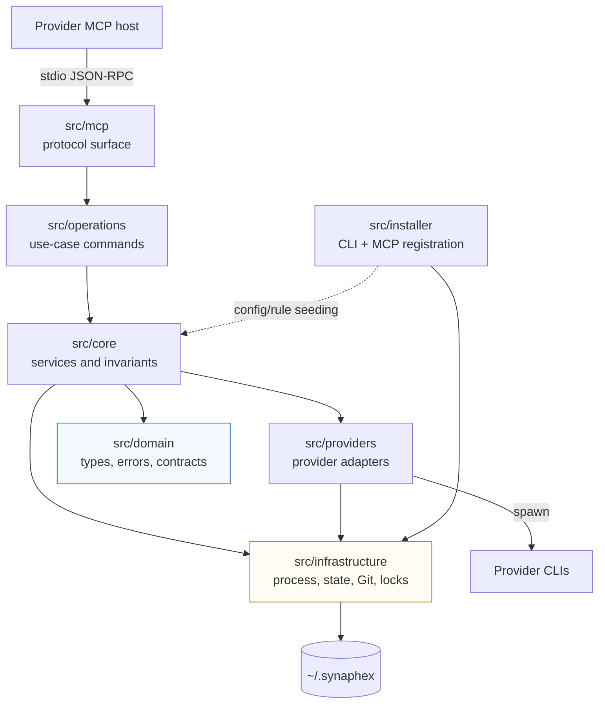
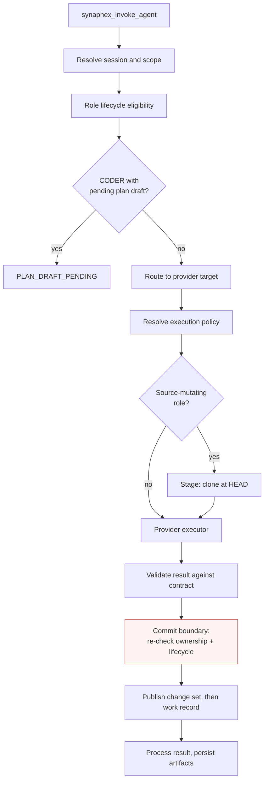

# Implementation architecture

Maintainer-level view of how Synaphex is built. For what Synaphex *is*, see
[the Synaphex model](../concepts/synaphex-model.md); this page is about layers,
dependency direction, and the invariants the code structure enforces.

## Development index

- **Architecture**
- [Repository structure](repository-structure.md)
- [Testing](testing.md)
- [CI](ci.md)
- [Releasing](releasing.md)
- [Architecture decisions](architecture-decisions.md)

## Layers



| Layer | Responsibility |
| --- | --- |
| `src/mcp` | Translates the MCP protocol into application operations. Owns tool registration, input validation, host-context resolution, and the public error mapping |
| `src/operations` | Use-case commands behind each tool — session, task, plan, change-set, continuation, memory |
| `src/core` | Services holding the invariants: routing, invocation, role contracts, rules, staging coordination, apply management, lifecycle |
| `src/domain` | Types, error classes, role contracts, execution-policy shapes. No behavior that touches the outside world |
| `src/providers` | One adapter per provider runtime: policy resolution, argument construction, result decoding, stderr sanitization |
| `src/infrastructure` | Process spawning, state persistence, isolated Git, recoverable locks |
| `src/installer` | The `synaphex` terminal command and provider MCP registration. Separate from the workflow surface |

## Dependency direction

Verified from actual imports rather than intent:

| From | Imports |
| --- | --- |
| `mcp` | operations, core, providers, infrastructure, domain |
| `operations` | core, infrastructure, domain |
| `core` | infrastructure, domain |
| `providers` | infrastructure, domain |
| `installer` | infrastructure, domain, **core** (config and rule seeding only) |
| `infrastructure` | *nothing* |
| `domain` | *nothing* |

Two properties hold in the current tree:

- **`domain` and `infrastructure` import no other layer.** Domain has no dependency on MCP transport, so protocol concerns cannot leak into invariants.
- **Nothing imports `mcp`.** The protocol surface is a leaf; no core service can reach back into the transport.

The one cross-cut worth naming: `installer` imports `core` in exactly two places, to seed agent configuration and the initial global rule document during `synaphex install`. That is deliberate reuse of the owning components rather than a duplicate seeding path — the installer must not invent its own copy of state the core layer owns.

## Architectural invariants

These are structural, not preferences. Changing one is an architecture decision, not a refactor.

| Invariant | Where it lives |
| --- | --- |
| The user is the orchestrator; there is no central coordinator | Absence of any scheduler; every step is an explicit tool call |
| Role contracts are immutable and not configurable | `FORBIDDEN_OUTGOING_TARGETS` and lifecycle contracts in `src/core/role-contract-registry.ts` |
| Rules can restrict a role, never widen one | Role contract is checked before rule resolution |
| Permission resolution ends in `default_deny` | `task > project > global > default_deny` precedence |
| MCP host identity is provider-only, set at startup | `src/mcp/mcp-host-context.ts`; no tool input can override it |
| Agent target is independent of host identity | Route resolution in `src/core/provider-router.ts` |
| Durable authority is revalidated at the commit boundary | See below |
| CODER never mutates the registered source | Staging coordinator + change-set publication |
| Fail closed when policy or state cannot be proven | Provider policy resolvers; `divergent` source observation; lock ownership checks |

### Invariant vs v0.1 limitation

Not everything currently refused is permanent:

| Architectural invariant | v0.1 implementation limitation |
| --- | --- |
| CODER produces reviewable proposals, never direct edits | Apply leaves changes staged rather than committed |
| A provider must enforce an invocation-scoped execution policy | Google/Antigravity cannot, so it fails closed |
| Host identity is provider-only | `vscode` is not an executable agent target |
| Package surface is a decision, not an accident | `exports: {}` — no Node SDK |
| Locks never expire on a timer | No public GC for quarantine markers or stale apply intents |

The left column should survive future versions. The right column may not.

## The six agents in implementation

A logical agent is **not** a class. It is a name that resolves through three independent axes:

| Axis | Owned by |
| --- | --- |
| What the role may ever do | `src/core/role-contract-registry.ts` — forbidden edges, lifecycle eligibility, source-mutation and memory capability |
| What it may record | `src/domain/agent-behavior.ts` + result processing — `outputFields` for RESEARCHER, CODER, REVIEWER |
| Who executes it | `agent_config.jsonc` → provider router → the matching adapter in `src/providers` |

So the same logical role can run on any supported provider without any role semantics changing. Provider choice is configuration; role capability is code.

**Role semantics are documented for users** in [agents](../concepts/agents.md) — not repeated here.

## Invocation pipeline

Order verified from `src/core/agent-invocation-service.ts`:



Two details matter more than the rest:

- The **plan-draft gate applies to CODER only**. Other agents are not blocked by an undecided draft.
- The **commit boundary re-checks authority**, using the same eligibility function used at preflight.

## Durable commit-boundary authority

The problem: provider execution and Git staging can take minutes. Holding the task lock for that whole time would serialize unrelated work and turn any crash into a long-lived stuck lock. But releasing it means the world can change underneath a long-running invocation.

The resolution, in `withTaskOwnershipAuthority`:

```text
preflight        check ownership + lifecycle
(lock released)  provider execution and Git staging run here
commit boundary  re-acquire authority, re-check, then publish
```

If ownership or lifecycle changed while the provider ran, the result is refused with `TASK_SESSION_OWNERSHIP_LOST` and **nothing is written**. A superseded session cannot overwrite whoever holds the task now.

This is why the staging coordinator splits `capture()` from `publish()`: the expensive Git work happens outside the lock, and only the publication step runs under authority. A `withinOwnershipAuthority` flag prevents the publication path from re-entering the same non-reentrant lock.

## CODER internal pipeline

```text
preflight        Git worktree? clean? supported shape?
prepare          clone --no-local --no-hardlinks at exact HEAD,
                 remove remotes, isolated HOME, mode 0700
execute          provider runs with cwd = staging clone
validate         result parsed against the role contract
capture          diff derived from Git state, not provider claims
                 (outside the task lock)
publish          under ownership authority: patch bytes, then metadata
dispose          staging tree removed
```

**No source mutation happens anywhere in this pipeline.** Applying a change set is a separate path in `src/core/change-set-apply-manager.ts`, driven by an explicit user decision, under the source-mutation lock.

The ordering inside `publish` is deliberate: patch bytes first, then metadata. A crash between them leaves metadata absent, and a change set without readable metadata is treated as corrupt rather than usable — an incomplete publication can never be mistaken for authoritative output.

**Details:** [ADR 0003](../architecture/0003-coder-staging-workspace.md), [CODER isolation](../security/coder-isolation.md).

## Locks

Four domains use `RecoverableProcessLock`:

```text
task binding · memory · plan · source mutation
```

Design properties:

- **Process-owner record.** The lock file names its owning process.
- **Definite-death recovery only.** A lock is reclaimed only when the owner can be proven gone (POSIX `process.kill(pid, 0)` liveness probing).
- **No TTL.** There is no timeout-based stealing, in any domain.
- **Fail closed on uncertainty.** An unknown or foreign owner means refusal, not takeover.
- **Generation-safe quarantine.** Recovery is capture-verify-restore: the lock is atomically renamed into `state/.lock-quarantine/`, verified, then either restored or discarded — so two concurrent recoverers cannot both win.

> **Lock recovery is not domain rollback.** Recovering a lock makes the resource available again; it does not undo partial domain work. That is why interrupted applies have their own explicit reconciliation path rather than relying on lock recovery.

**Known maintenance debt:** quarantine markers and stale apply-intent records have no garbage collector in v0.1. Both are inert.

**Details:** [ADR 0004](../architecture/0004-recoverable-process-lock.md).

## Continuations

When an agent requests another agent call or an action, Synaphex records a **continuation** rather than acting.

| Property | Value |
| --- | --- |
| Storage | Process-local, in memory |
| Lifetime | Ephemeral — lost when the MCP server exits |
| Capacity | 64 records (implementation limit, not a user contract) |
| Advancement | Explicit tool call only |
| Host context | Inherited provider-only identity |

**Nothing auto-runs.** `execute_helper` runs an already-`allow`ed call; `approve_and_execute_helper` is itself the approval for an `ask`. Network follows the same shape with `continue_allowed_network` and `approve_network_action`, and under `deny` there is no tool to call at all.

CODER is excluded from helper continuation invocation — it runs only through direct top-level invocation.

## Related

- [ADR index](architecture-decisions.md)
- [Security model](../security/security-model.md)
- [MCP tools reference](../reference/mcp-tools.md)
