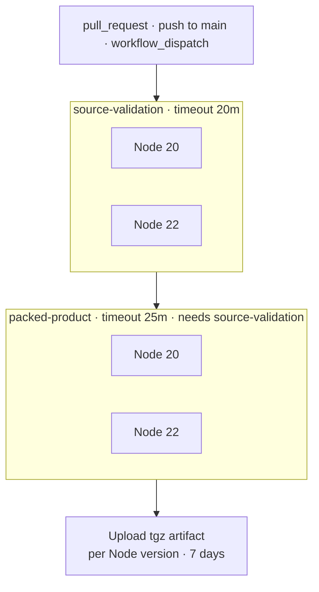

# Continuous integration

What `.github/workflows/ci.yml` runs, and why it is shaped that way.

## Development index

- [Architecture](architecture.md)
- [Repository structure](repository-structure.md)
- [Testing](testing.md)
- **CI**
- [Releasing](releasing.md)
- [Architecture decisions](architecture-decisions.md)

## Triggers and settings

| Setting | Value |
| --- | --- |
| Triggers | `pull_request`, `push` to `main`, `workflow_dispatch` |
| Permissions | `contents: read` |
| Concurrency | `ci-${{ github.workflow }}-${{ github.ref }}`, `cancel-in-progress: true` |
| Runner | `ubuntu-latest` (both jobs) |
| Node matrix | `20` and `22`, `fail-fast: false` |

Concurrency cancellation is **CI execution hygiene only** — a newer commit on the same ref supersedes an in-flight run. It has nothing to do with Synaphex invocation semantics, which deliberately have no cancellation.

## Job flow



Both matrix legs of `packed-product` upload their own artifact, named `synaphex-package-node20` and `synaphex-package-node22`, with `if-no-files-found: error`.

## Job 1: source validation

**Does the source tree hold up?** Steps, in order:

```text
actions/checkout@v4
actions/setup-node@v4      (matrix Node, cache: npm)
npm ci
npm run typecheck
npm run build
npm test
npm run test:mcp-stdio
git diff --check
npm pack --dry-run
```

The full suite is canonical and **deliberately not split into subsets** — splitting is how security, race, and crash-recovery coverage quietly stops running.

There is no lint or markdown gate. `git diff --check` catches whitespace damage; formatting is not otherwise enforced by CI.

## Job 2: packed product

**Does the artifact a user installs actually work?** This job exists because three real defects were invisible to job 1 and appeared only under `npm pack` → `npm install -g` → global bin shim.

```text
actions/checkout@v4
actions/setup-node@v4      (matrix Node, cache: npm)
npm ci
npm run test:packed-product
npm pack --pack-destination dist-artifact
actions/upload-artifact@v4
```

It `needs: source-validation`, so a broken source tree never reaches the more expensive gate.

The uploaded tarball is **not publication** — it keeps the exact artifact that passed the gate downloadable for inspection. Release is a separate workflow; see [releasing](releasing.md).

What the suite actually covers is documented in [testing](testing.md#packed-product-testing) rather than repeated here.

## Linux only

Both jobs run only on `ubuntu-latest`, deliberately.

Synaphex's infrastructure is POSIX-specific by design: `process.kill(pid, 0)` liveness probing, hardlink-based atomic lock publication, `HOME`-override provider isolation, and a `/dev/null` Git `hooksPath`. A Windows port needs its own liveness-probe implementation ([ADR 0004](../architecture/0004-recoverable-process-lock.md)).

Claiming a support matrix CI does not actually verify would be dishonest, so [compatibility](../reference/compatibility.md) claims Linux only.

## Node 20 and 22

`package.json` declares `engines: node >=20`. CI runs the **full suite on both ends of the supported range** rather than assuming the declaration holds. Newer majors are permitted by `engines` but are not validated, and the docs say so.

## Secrets

**CI requires no secrets.** No provider API keys, no model invocation, no npm token. The only network access is the dependency install itself.

This is what makes CI fork- and PR-safe: a pull request from an untrusted fork runs the same gates with nothing to leak.

Publishing credentials appear nowhere in `ci.yml`. Release authentication is OIDC-based and lives only in the release workflow — see [releasing](releasing.md#trusted-publishing).

## Related

- [Testing](testing.md)
- [Releasing](releasing.md)
