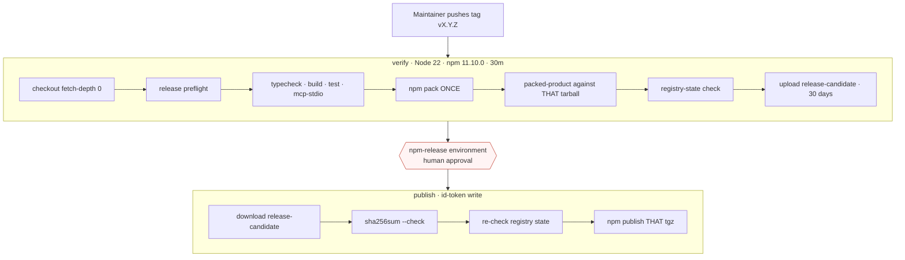

# Releasing

Operator documentation for `.github/workflows/release.yml` and the release
scripts. **Nothing on this page should be executed casually** — publishing to
npm is irreversible.

## Development index

- [Architecture](architecture.md)
- [Repository structure](repository-structure.md)
- [Testing](testing.md)
- [CI](ci.md)
- **Releasing**
- [Architecture decisions](architecture-decisions.md)

## Version authority

**`package.json` is the single source of version truth.** A Git tag only asserts what the committed version already says; disagreement is a hard failure, not something to reconcile.

The tag must be exactly `v${version}` — `v0.1.0` for version `0.1.0`.

Preflight checks, from `scripts/release/release-preflight.mjs`:

| Check | Failure |
| --- | --- |
| `package.json` has a version | No version |
| Version is stable `X.Y.Z` | Prereleases unsupported — no dist-tag policy exists yet |
| `package-lock.json` version matches | Lockfile drift |
| `package-lock` root package version matches | Lockfile drift |
| `package-lock` name matches | Wrong lockfile |
| Tag equals `v${version}` | Tag/version mismatch |
| Tagged commit is an ancestor of `origin/main` | Tag not on the release branch |
| Package is not `private` | Would refuse to publish |
| `repository` points at the canonical repo | Required for provenance |
| `files` allowlist is declared | Otherwise the tarball is unbounded |
| Every `bin` path exists in the build output | A bin pointing at nothing |
| License is declared, not `UNLICENSED`, and `LICENSE` exists | Declaring a license the package cannot substantiate |

## Release flow



Trigger is a pushed tag matching `v*.*.*`. It never runs on an ordinary merge.

| Setting | Value |
| --- | --- |
| Runner | `ubuntu-latest` |
| Node | `22` (both jobs) |
| npm | pinned `11.10.0` |
| Default permissions | `contents: read` |
| `publish` permissions | `contents: read`, `id-token: write` |
| Concurrency | `release-${{ github.ref }}`, `cancel-in-progress: false` |
| Timeouts | `verify` 30m, `publish` 20m |
| Environment gate | `npm-release` on the `publish` job |

Node 22 is pinned because Trusted Publishing needs a recent runtime; application support remains Node 20 and 22, which `ci.yml` continues to prove. npm is pinned rather than `latest` because Trusted Publishing behavior depends on the npm version, and a publish-critical job must not drift.

`cancel-in-progress: false` is deliberate — cancelling a release mid-publish is worse than letting it finish.

The `verify` job re-runs the full gates on the tagged commit. **Passing CI earlier is not release authority.**

## The exact-artifact rule

This is the most important property of the whole design.

```text
npm pack        ONCE, in verify
  → sha256 recorded
  → packed-product validates THAT file
  → registry state checked against THAT file's integrity
  → uploaded as an artifact
  → publish downloads it, re-checks sha256sum
  → npm publish <that exact .tgz>
```

> **The normal workflow never runs `npm publish .`** Publishing from a working directory would repack, producing bytes that were never validated. The file that was tested and the file that reaches the registry must be byte-identical.

The `publish` job independently verifies integrity with `sha256sum --check SHA256SUMS` before publishing, so a corrupted or substituted artifact fails closed rather than shipping.

## Registry state

`scripts/release/registry-state.mjs` classifies the target version before any publish attempt:

| State | Meaning | Outcome |
| --- | --- | --- |
| `absent` | Version not published | **The only state permitting a publish** |
| `published_match` | This exact artifact is already published | Idempotent — a rerun is already done |
| `published_differs` | Version exists with different integrity | **Fail closed.** Never republish over it |
| `unavailable` | Registry unreachable or gave no integrity value | **Fail closed** |

Comparison is by npm's recorded `dist.integrity`, not by version string alone — so "already published" means genuinely the same bytes.

The check runs **twice**: once in `verify`, and again in `publish` after the approval gate. A rerun following a successful publish must not attempt the immutable version again.

## Trusted Publishing

Automated releases authenticate with **GitHub Actions OIDC via npm Trusted Publishing**.

Requirements:

```text
permissions: id-token: write        (publish job only)
environment: npm-release           (protected, human-approved)
registry-url: https://registry.npmjs.org
```

> **There is deliberately no `NPM_TOKEN` or `NODE_AUTH_TOKEN` anywhere in the release workflow**, and no token-based fallback branch. Adding one would put a long-lived credential into exactly the place this design keeps it out of.

**Provenance** is generated automatically by Trusted Publishing for a public repository and is deliberately never disabled. There is no custom signing step; provenance comes from the platform.

## First publish bootstrap

A package must exist before a Trusted Publisher can be configured for it, so **the first publish is deliberately outside automated CD**.

Current state, from [ADR 0008](../architecture/0008-release.md): an unrelated historical `synaphex` package was fully unpublished, which starts an npm **24-hour cooldown** before the name accepts a new version. That window is not modelled or guessed locally — npm is authoritative and simply rejects an early attempt.

```text
1. wait out npm's 24-hour post-unpublish cooldown
2. npm run release:prepare
      builds, packs ONCE, runs preflight and the packed-product gate
      against that exact tarball, prints its sha256 and SRI
3. review the printed checksum and package contents
4. publish that exact artifact from a maintainer-authenticated npm CLI:
      npm publish ./release-candidate/synaphex-0.1.0.tgz
   never `npm publish` from the checkout, which would repack
5. the package now exists
6. configure npm Trusted Publishing:
      owner       cyhunblr
      repository  synaphex
      workflow    .github/workflows/release.yml
      environment npm-release
7. create/review the GitHub npm-release Environment and its reviewers
8. every subsequent release runs through tokenless OIDC CD
```

`npm run release:prepare` **cannot publish, tag, authenticate, or read a credential.** It produces a local candidate under `release-candidate/` (gitignored) and prints what to review. The maintainer performs step 4 themselves.

### Credential policy

Bootstrap authentication is a maintainer-authenticated npm CLI and nothing more. Whatever credential the maintainer's own npm security policy requires stays entirely outside this project: **Synaphex does not store it, read it, place it in scripts or CI, or record its value anywhere.** Automated CD remains tokenless OIDC.

## What release automation does not do

```text
version bumps        tag creation         GitHub Release creation
unpublish/deprecate  npm account setup    trusted-publisher registration
dist-tag rollback    automatic rollback
```

**Tags are created by a human.** The workflow reacts to a tag; it never creates one, and it never bumps a version.

**There is no automatic rollback.** `npm unpublish`, `npm deprecate`, and dist-tag changes are deliberate manual operations. A published version is immutable.

**GitHub Release automation is deferred post-v0.1.** No GitHub Release is created automatically today.

## Maintainer sequence

For a normal release, once bootstrap is complete:

1. Decide the version; update `package.json` and `package-lock.json` together.
2. Commit to `main` and push.
3. Verify locally with `npm run release:preflight` (read-only) or the full `npm run release:prepare`.
4. Create and push the tag `v${version}`.
5. Watch `verify`; it re-runs every gate on the tagged commit.
6. Approve the `npm-release` environment gate when satisfied.
7. `publish` verifies integrity, re-checks registry state, and publishes the exact tarball.

## Failure behavior

All of these fail closed, before any registry mutation:

| Failure | Where |
| --- | --- |
| Tag does not match `v${version}` | Preflight |
| Lockfile version or name mismatch | Preflight |
| Prerelease version | Preflight — no dist-tag policy yet |
| Tag not an ancestor of `origin/main` | Preflight |
| Missing `files`, bad `repository`, missing `bin` output | Preflight |
| Missing or `UNLICENSED` license | Preflight |
| Typecheck, build, test, or stdio failure | Verify |
| Packed-product failure on the exact tarball | Verify |
| Version already published with different integrity | Registry state |
| Registry unreachable | Registry state |
| Artifact checksum mismatch | Publish |
| Environment approval withheld | Publish gate |

## Related

- [ADR 0008: Release and CD](../architecture/0008-release.md)
- [CI](ci.md)
- [Compatibility](../reference/compatibility.md)
