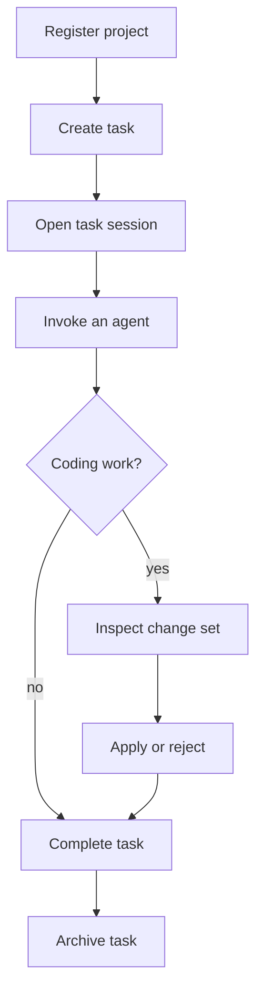
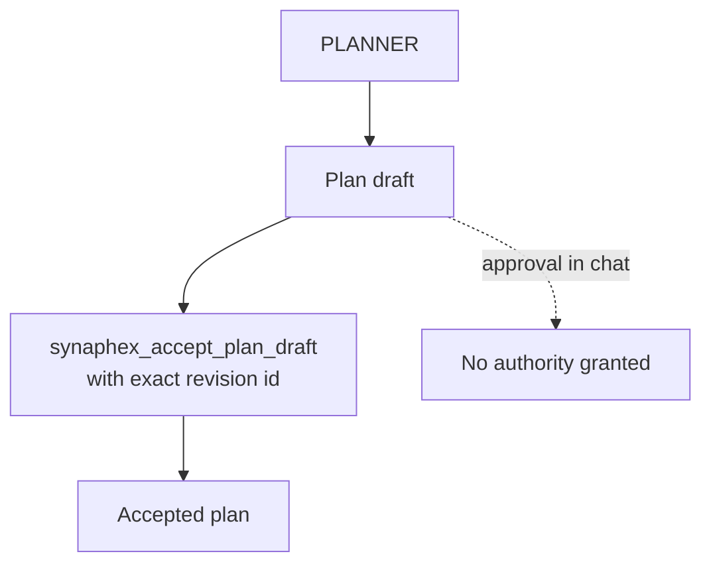
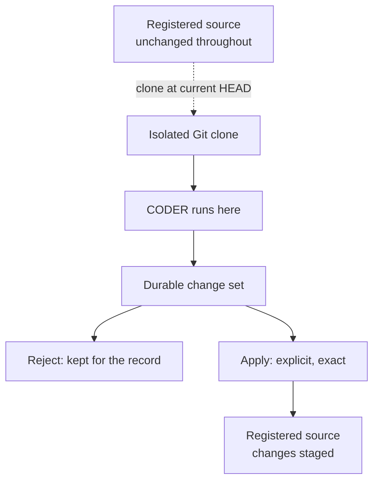
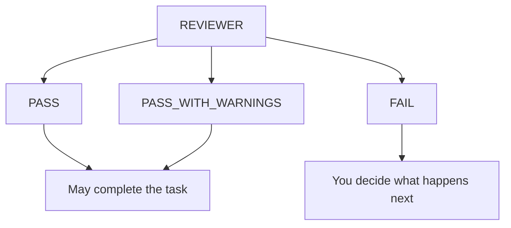
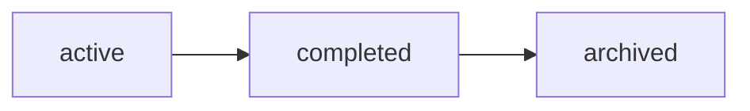

# First workflow

This page walks through one small piece of work end to end: adding a validation
check to an existing TypeScript project.

Before starting, complete [first setup](first-setup.md) and configure at least
one agent for a provider you are signed in to.

## You orchestrate

Synaphex never decides the next step. It does not run QUESTIONER, then PLANNER,
then CODER on your behalf, and finishing one role does not start another.

You choose each step. Synaphex enforces what is *allowed* at each step — whether
a role may run, whether an agent may call another agent, and whether a result may
change durable state.

> **You are the orchestrator.** Synaphex does not choose the next agent for you.

The walkthrough below follows one common route. It is **an example, not a
required sequence** — every arrow is a decision you make:



There is no mandatory pipeline. All of these are valid too:

```text
QUESTIONER → PLANNER → accept plan → CODER → apply → REVIEWER
RESEARCHER → EXAMINER
CODER                       (when no plan draft is pending and rules permit)
```

## How you talk to Synaphex

You work through your provider. Synaphex is an MCP server, so you ask the
provider to call its tools — in your own words, or by naming the operation when
precision matters.

Naming the operation is worth doing at decision points. "Looks good, go ahead"
is conversation; accepting a plan is a specific operation with its own authority.

## The pieces

| Term | What it is |
| --- | --- |
| **Project** | A registered path to source you already have. |
| **Task** | One unit of work inside a project. |
| **Session** | Your logical binding to a project or task. Not a provider chat, thread, or process. |
| **Plan draft** | PLANNER's proposal. Not yet authoritative. |
| **Accepted plan** | A draft you explicitly accepted, by exact revision. |
| **Change set** | CODER's captured output — an immutable patch against an exact baseline. |

A task has at most one writable session at a time. If someone else holds it,
your operations are refused rather than silently taking over.

## 1. Register the project

Synaphex does not create or clone repositories. Point it at source you already
have:

> Use Synaphex to register the project at `/path/to/project` with the name
> "My Project".

This calls `synaphex_register_project` and returns a project id like
`prj_...`. Registering reads nothing from your repository and changes nothing in
it.

## 2. Create a task and open a session

> Create a Synaphex task in that project: "Add input validation to the config
> loader". Then open a task session for it.

This calls `synaphex_create_task`, then `synaphex_open_task_session`, which
returns a session id like `ses_...`. Most later operations take that session id
as their only authority — it identifies both the task and your ownership of it.

To work at project scope without a task, use `synaphex_open_project_session`
instead. Some roles, such as RESEARCHER and EXAMINER, can run there.

## 3. Clarify, if the work is vague

> Invoke the Synaphex QUESTIONER for this session to clarify what the validation
> should cover.

This calls `synaphex_invoke_agent` with `agent: "questioner"` and a
`task_session` scope. QUESTIONER gathers requirements and working context. It
does not plan and does not implement.

Skip this when the work is already clear.

## 4. Plan

> Invoke the Synaphex PLANNER for this session.

PLANNER produces a **plan draft**. A draft is a proposal, not an instruction.

Read it back with `synaphex_get_plan_state`, which returns the draft along with
its revision id.

### Accepting a plan is an explicit act



A draft becomes authoritative only through `synaphex_accept_plan_draft`, which
takes the session id **and the exact `draftRevisionId`** you reviewed. Binding
acceptance to a revision means you cannot accidentally accept a draft that was
rewritten after you read it.

> **A plan draft is not an accepted plan.** Saying "that plan looks good" grants
> no authority on its own.

> Accept the Synaphex plan draft for this session, using revision
> `planrev_...`.

To discard it instead, use `synaphex_reject_plan_draft` with the same revision
id.

**While a draft is pending, CODER is blocked.** Accept it or reject it first.
That is deliberate: it stops implementation from racing an undecided plan.

## 5. Implement

> Invoke the Synaphex CODER for this session.

This is where Synaphex's safety model does the most work.

> **CODER does not mutate your repository during execution.**



Synaphex:

1. Verifies your worktree is clean, and refuses to start if it is not.
2. Creates an isolated Git clone at your current `HEAD`, with no remotes.
3. Runs CODER there — the provider sees the staging clone as its workspace.
4. Captures the result from Git state as an immutable **change set**.
5. Discards the staging workspace.

While CODER runs, your repository is untouched. `HEAD` has not moved, nothing is
staged, and no file has changed.

> CODER requires a clean worktree. Commit or stash your own work first.

## 6. Review and decide

The invocation result includes a change-set id. Inspect it before deciding:

- `synaphex_get_change_set` — the baseline commit, patch size, and which files
  changed, derived from Git rather than from anything the model claimed.
- `synaphex_read_change_set_patch` — the exact patch bytes.

Then choose:

> Apply the Synaphex change set `changeset_...` for this session.

`synaphex_apply_change_set` requires your source to still sit at the recorded
baseline with a clean worktree. If it does, Synaphex applies the exact reviewed
result and verifies it matches. If your source has moved on, apply **fails** —
it never merges, rebases, or reconciles on your behalf.

After a successful apply:

- changes are **staged** in your repository;
- nothing is committed;
- nothing is pushed;
- `HEAD` has not moved.

Committing is yours to do, in your own style.

To discard the work instead, use `synaphex_reject_change_set`. The patch is kept
for the record but can never be applied afterwards.

## 7. Review the result

> Invoke the Synaphex REVIEWER for this session.

REVIEWER runs only when your source actually reflects the applied change set. If
you edited or committed since applying, it refuses rather than reviewing
something that was never checked.

It returns one of:

| Outcome | Meaning |
| --- | --- |
| `PASS` | The work is acceptable. May complete the task. |
| `PASS_WITH_WARNINGS` | Acceptable, with noted concerns. May complete the task. |
| `FAIL` | Not acceptable. |

**REVIEWER does not fix anything.** A `FAIL` does not start CODER. You decide
whether to invoke CODER again, adjust the plan, or stop.

## 8. Complete and archive

These are two different things.



A `FAIL` does not start CODER, and nothing retries on its own.

Lifecycle is one-way:



**Complete** marks the work done:

```text
synaphex_complete_task   { sessionId }
```

A REVIEWER `PASS` may complete the task itself, or you can complete it directly
— a review is not required. Completion refuses while a plan draft is still
pending or a change set is still undecided, so nothing is left dangling.

Completion keeps your session and task ownership. Roles whose contracts permit a
completed task, such as RESEARCHER and EXAMINER, can still run.

**Archive** closes it out:

```text
synaphex_archive_task   { projectId, taskId }
```

Archiving releases the task session and ownership, and preserves everything:
plans, artifacts, change sets, decisions, review history, and memory.

Archiving is terminal. There is no reopen or unarchive. New work after archiving
means a new task.

Archive takes a project and task id rather than a session, so you can archive a
completed task whose session is long gone.

## 9. Close your session

If you finish without archiving:

```text
synaphex_close_session   { sessionId }
```

This releases your task ownership so the task can be picked up again later.

## The full sequence

```text
synaphex_register_project      register existing source
synaphex_create_task           define the unit of work
synaphex_open_task_session     take ownership

synaphex_invoke_agent          QUESTIONER   (optional)
synaphex_invoke_agent          PLANNER
synaphex_get_plan_state        read the draft and its revision
synaphex_accept_plan_draft     explicit, revision-bound

synaphex_invoke_agent          CODER        (staged; source untouched)
synaphex_get_change_set        inspect
synaphex_read_change_set_patch exact bytes
synaphex_apply_change_set      exact, staged, no commit

synaphex_invoke_agent          REVIEWER
synaphex_complete_task
synaphex_archive_task
```

## If something goes wrong

- **CODER refuses to start.** Your worktree is not clean. Commit or stash first.
- **Apply fails.** Your source moved since the change set was captured. Return it
  to the recorded baseline, or run CODER again from where you are now.
- **REVIEWER refuses.** The change set is not applied, or your source no longer
  matches it.
- **Completion refuses.** A plan draft or change set is still undecided.
- **An apply was interrupted.** Use `synaphex_get_apply_recovery_state` to see
  what Synaphex observes, then `synaphex_reconcile_interrupted_apply`. Synaphex
  never resets your source automatically after an interruption — it only makes a
  transition it can prove is consistent.

## Next

- [Installation](installation.md)
- [First setup](first-setup.md)
