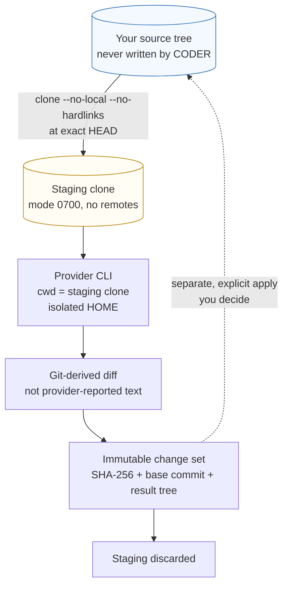

# CODER isolation

CODER is the only agent that produces source changes, so it is the only agent
with a dedicated containment story. This page describes exactly what that
containment is and where it stops.

> **CODER never runs in your source tree.** It runs in a throwaway Git clone.
> Your working tree is not modified by a CODER invocation — not even on success.

## The boundary

## What is actually isolated

Verified against the implementation:

- **The clone is local-path only.** It is created with `--no-local
  --no-hardlinks --no-checkout` from a filesystem path, never a remote URL, so
  cloning performs no network access. `--no-hardlinks` means the staging repo
  gets its own objects rather than alternating into your `.git`.
- **All remotes are removed** after cloning, and the final remote list is
  re-audited after the provider runs.
- **`HOME` is redirected** to an empty temporary directory for Synaphex's own Git
  commands, so `~/.gitconfig` cannot apply. `GIT_CONFIG_GLOBAL` is deliberately
  not relied upon — it was added in Git 2.32 and is silently ignored on 2.25.x.
- **`GIT_CONFIG_NOSYSTEM=1`** suppresses system config.
- **Hooks cannot run**: `core.hooksPath` points at a non-directory, so no
  repository or user hook executes as a side effect of a Synaphex Git command.
- **fsmonitor, external diff, textconv, pager, terminal prompt, replace refs and
  alternate object directories are neutralised explicitly.**
- **`shell: false`** everywhere, with `git` as the executable — never `sh -c`.
- **The staging directory is mode `0700`.**
- **The diff is derived from Git state**, not from what the provider claims it
  changed. A provider cannot inflate or hide a file by describing it differently.

## What is not isolated

- **The provider process inherits the full environment.** Synaphex deliberately
  omits `env` when spawning provider CLIs so provider-owned authentication keeps
  working. The isolated-environment guarantees above apply to *Synaphex's own Git
  subprocesses*, not to the provider process.
- **The provider process is not network-isolated by Synaphex.** For OpenAI,
  Synaphex passes a sandbox mode and sets
  `sandbox_workspace_write.network_access=false` unless network is explicitly
  approved — but enforcement is the provider's, not Synaphex's.
- **Nothing stops a provider from reading outside the staging directory.** The
  clone bounds where writes are *collected from*, not what the process can read.
  A provider CLI running as you can read any file you can read.
- **The change set is not inspected for malicious content.** Synaphex verifies
  integrity and applicability, never intent.

## Integrity of the result

A published change set records the base commit, the expected result tree, a
SHA-256 of the patch, and its byte length. On read, both the hash and the length
are re-checked; a mismatch is reported as corrupt rather than returned. Change
sets are written exclusively — an existing id can never be overwritten in place.
An empty capture publishes nothing at all rather than persisting a fake patch.

## Applying is a separate decision

Capture and apply are deliberately distinct. Before applying, Synaphex classifies
your source as `base_clean`, `exact_applied`, or `divergent`, and a change set
moves through `pending → applying_interrupted → applied | rejected`. Synaphex
never runs `reset --hard` or `git clean` on your behalf.

See [change sets](../workflows/coder-change-sets.md) and
[interrupted-apply recovery](../workflows/interrupted-apply-recovery.md).

## Related pages

- [Security model](security-model.md)
- [Permissions](permissions.md)
