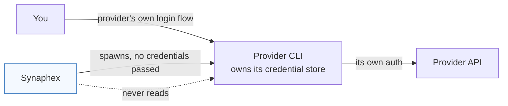

# Credentials and authentication

> **Synaphex stores no provider credentials.** It never reads, writes, prompts
> for, or transmits an API key. Authentication belongs entirely to each provider
> CLI, which Synaphex treats as an opaque, already-authenticated tool.

## How authentication actually works

You authenticate each provider CLI yourself, using that provider's own command —
before Synaphex is involved. Synaphex then invokes the CLI and the CLI uses the
credentials it already holds.

Synaphex has no credential configuration field. There is no `apiKey` setting in
any Synaphex config file, and adding one would do nothing.

## Environment inheritance — read this

This is the single most important credential fact about Synaphex, and it is a
deliberate design decision rather than an oversight:

> **Provider CLI processes inherit the complete environment of the Synaphex
> process, including every environment variable it holds.**

Synaphex intentionally omits `env` when spawning provider CLIs, because provider
authentication frequently lives in environment variables or in state reachable
through `HOME`. Overriding the environment would break subscription-based and
cached logins.

The consequence, stated plainly:

- **Synaphex does not scrub secrets from the environment.** If `AWS_SECRET_ACCESS_KEY`,
  a database URL, or an unrelated API token is present in the environment when
  Synaphex starts, provider CLIs launched by Synaphex will see it.
- This is the same exposure you would have running the provider CLI directly from
  that shell — Synaphex neither widens nor narrows it.
- If that matters for your environment, launch your MCP host from a shell that
  does not carry unrelated secrets. Synaphex cannot do this for you.

### The one place the environment *is* controlled

Synaphex's **own Git subprocesses** run with a minimal, deterministic
environment — only `PATH`, an isolated `HOME`, `GIT_CONFIG_NOSYSTEM=1` and
`GIT_TERMINAL_PROMPT=0`. That applies to staging Git operations, **not** to
provider execution. Do not generalise it.

## Diagnostic redaction, and its limits

When a provider invocation fails, Synaphex may include a bounded stderr excerpt
to make the failure diagnosable. Before that excerpt is surfaced it is passed
through a redactor that:

- strips ANSI escape sequences,
- replaces `Bearer <token>` with `Bearer [REDACTED]`,
- redacts `API_KEY`, `AUTH_TOKEN`, `ACCESS_TOKEN` and the provider-specific
  `OPENAI_API_KEY` / `ANTHROPIC_API_KEY` when they appear as `NAME=value` or
  `NAME: value`,
- and truncates the result to the last ~20 lines / 4,000 characters.

**This is best-effort pattern matching, not a guarantee.** A secret in a shape
the patterns do not match — a bare token on its own line, a differently named
variable, a credential embedded in a URL — will not be redacted. Treat provider
diagnostics as potentially sensitive.

Captured provider output is bounded (64 KiB tails by default), which limits
accidental bulk disclosure but is a resource control, not a security control.

## Local state on disk

| Property | Actual behaviour |
| --- | --- |
| Location | `~/.synaphex` |
| Encryption | **None.** All state is plaintext |
| File mode | `0600` on state files written by Synaphex |
| Directory mode | `0700` for staging and provider temp directories |
| Credentials stored | None |
| Protection from other OS users | Yes, via file mode |
| Protection from processes running as you | **No** |

Synaphex writes state atomically (temp file, then rename or exclusive link), so a
crash does not leave a half-written file that reads as valid. That is a
durability property, not a confidentiality one.

Change-set metadata deliberately excludes the staging path, ownership tokens,
provider credentials, and raw provider stderr.

## What Synaphex never does

- Never prompts for, stores, or transmits an API key.
- Never reads a provider's credential files or auth cache.
- Never installs, updates, or authenticates provider software. `synaphex install`
  registers MCP entries only; it runs no package manager and no installer script.
- Never opens a network listener or sends telemetry.

## Related pages

- [Security model](security-model.md)
- [Providers and routing](../concepts/providers-and-routing.md)
- [Installation](../getting-started/installation.md)
