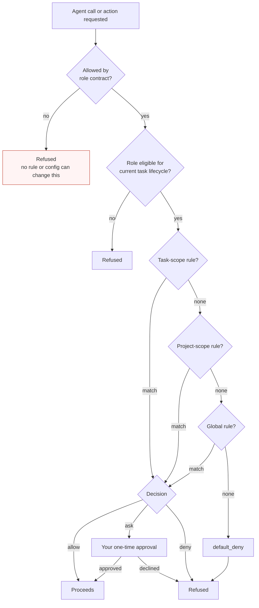

# Permissions

Synaphex answers two separate questions before anything happens. Confusing them
is the most common source of wrong expectations.

> **Role contracts decide what is *ever* possible. Rules decide whether a
> possible thing is allowed right now.** Rules can restrict a role. They can
> never widen one.

## Decision flow

## Layer 1: role contracts

Fixed in code, not configurable:

- `planner → coder` is **forbidden**. A planner cannot trigger implementation.
- `coder → reviewer` is **forbidden**. Work cannot approve itself.
- `coder → planner` is allowed only for `plan_clarification`,
  `implementation_deviation`, and `plan_revision`.

There is no configuration file, rule, or MCP tool input that enables a forbidden
edge. Lifecycle eligibility is checked twice — at preflight and again at the
commit boundary inside the ownership authority — so a lifecycle change during a
long-running invocation cannot slip through.

## Layer 2: rules

Rules resolve in strict precedence: **task > project > global > default_deny**.
The first matching scope decides; no lower scope is consulted afterwards. Each
rule yields `allow`, `ask`, or `deny`.

Synaphex ships with 16 agent-call edges and 3 actions, **all set to `ask`**. The
shipped posture is that you are consulted for everything, and you narrow from
there.

An `ask` approval is **one-time and per-invocation**. It is not remembered, not
promoted to a rule, and not reused for the next call.

## Fail-closed behaviour

| Situation | Result |
| --- | --- |
| No rule matches at any scope | Denied |
| Rule file missing or malformed | Denied; the error is surfaced, not swallowed |
| Ownership liveness uncertain | Denied; the lock is never stolen on a timeout |
| Target surface is `vscode` | `AGENT_TARGET_SURFACE_UNSUPPORTED`, never a silent downgrade |
| Capability unusable for this invocation | Treated as not granted |

There is no timeout-based lock stealing, and no `force_unlock`-style escape tool
is exposed over MCP.

## What permissions do not cover

- They govern actions **through Synaphex**. Once a provider CLI is running, its
  own file and network access is bounded by the provider's sandbox, not by these
  rules.
- Approving an action approves *that* action. It grants no standing permission.
- Rules cannot grant an agent a capability its role contract lacks.

## Related pages

- [Rules and permissions concepts](../concepts/rules-and-permissions.md)
- [Rules configuration](../configuration/rules.md)
- [Security model](security-model.md)
