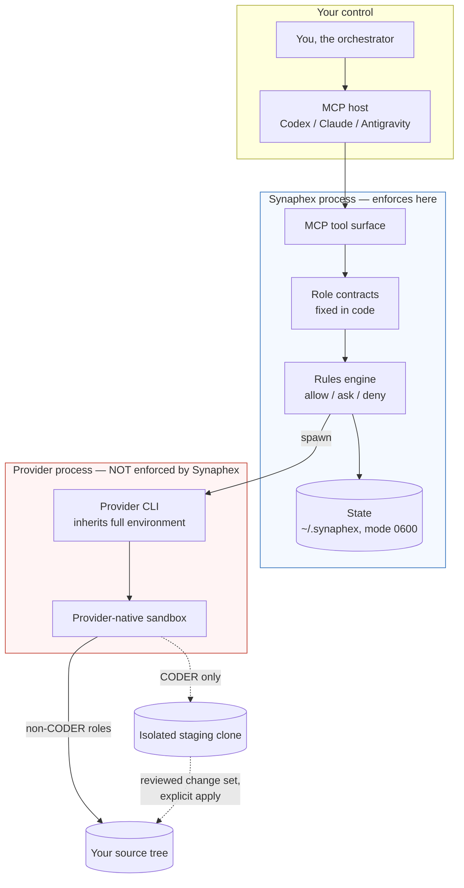

# Security model

This page states what Synaphex actually enforces, and — just as importantly —
what it does not. Every claim here corresponds to behaviour in the shipped
implementation. Where a protection does not exist, this page says so plainly
rather than implying it.

> **Synaphex is a coordination layer, not a sandbox.** It constrains what agents
> may do *through Synaphex*. It does not contain a provider CLI that has already
> been launched, and it does not defend against a hostile provider binary.

## What Synaphex is trusting

Synaphex runs on your machine, as you, with your privileges. Four things are
trusted and are outside anything Synaphex can verify:

| Trusted component | Why it is trusted | Consequence if it misbehaves |
| --- | --- | --- |
| The provider CLI binary (`codex`, `claude`, `agy`) | Synaphex executes it directly | Full user-level compromise; Synaphex cannot detect or contain it |
| The provider's own sandbox | Synaphex selects a mode, the provider enforces it | Workspace/network limits may not hold |
| Your operating system account | State files are protected by file mode only | Anything running as you can read Synaphex state |
| The MCP host application | It decides which tools to call | It can drive any workflow you could drive |

## Trust boundaries

The red region is the important one: once Synaphex spawns a provider CLI, the
provider is responsible for its own confinement. Synaphex chooses the mode and
the working directory; it does not police what the process does afterwards.

## What Synaphex enforces

These are real, code-level guarantees:

- **Role contracts are fixed in code.** `planner → coder` and
  `coder → reviewer` are forbidden edges that no configuration can enable.
  `coder → planner` is permitted only for three declared purposes.
- **Rules default to `ask`.** Every agent-call edge and action ships as `ask`
  under a `task > project > global > default_deny` precedence chain. An unmatched
  request is denied, not allowed.
- **CODER never writes to your source tree.** It runs in an isolated Git clone.
  See [CODER isolation](coder-isolation.md).
- **Source mutation requires an explicit, separate apply step.** A change set is
  inert data until you apply it.
- **Result payloads are field-restricted.** A result carrying a field outside the
  configured `outputFields` is rejected before anything is persisted.
- **Ownership is generation-safe.** Locks are verified by capture-verify-restore;
  uncertain ownership fails closed rather than stealing the lock.
- **No network listener.** Synaphex speaks MCP over stdio. It binds no port, runs
  no daemon, and accepts no remote connections.

## What Synaphex does not protect against

Stated directly, because assuming otherwise is the actual risk:

- **Synaphex does not sandbox provider processes.** It passes a sandbox mode to
  providers that support one and relies on the provider to enforce it.
- **Synaphex does not scrub the environment of provider processes.** Provider
  CLIs inherit the full environment of the Synaphex process, including any API
  keys present there. See [credentials and auth](credentials-and-auth.md).
- **Synaphex does not encrypt local state.** Everything under `~/.synaphex` is
  plaintext on disk, protected only by file mode.
- **Synaphex does not defend against a malicious provider binary.** A compromised
  CLI runs with your privileges.
- **Synaphex does not review the content of a change set for you.** It guarantees
  the patch is intact and applies to the recorded base — not that it is safe.
- **Synaphex does not protect against other processes running as your user.**
  Mode `0600` stops other users, not you.
- **Synaphex has no formal verification and no adversarial-containment claim.**
  The guarantees above are ordinary software invariants covered by tests.

## Threat boundary summary

| # | Threat | Handled? | Mechanism, or why not |
| --- | --- | --- | --- |
| 1 | Agent edits source without review | **Prevented** | CODER runs in an isolated clone; source mutation is a separate explicit apply |
| 2 | Config re-enables a forbidden agent edge | **Prevented** | Forbidden edges are constants in code, unreachable from config |
| 3 | Unmatched permission request silently allowed | **Prevented** | Precedence terminates in `default_deny` |
| 4 | Stale lock from a dead process blocks work forever | **Handled** | Generation-safe capture-verify-restore recovery |
| 5 | Crash mid-apply leaves ambiguous source state | **Handled** | `applying_interrupted` state plus explicit reconciliation; no automatic reset |
| 6 | Tampered or truncated change-set patch applied | **Prevented** | SHA-256 hash and byte-length verified on read |
| 7 | User Git config or hook influences staging | **Prevented** | Isolated `HOME`, `GIT_CONFIG_NOSYSTEM=1`, `core.hooksPath=/dev/null` |
| 8 | API key in environment reaches provider process | **NOT prevented** | Provider CLIs inherit the full environment by design |
| 9 | Local state readable by anything running as you | **NOT prevented** | File mode `0600` only; no encryption |

## Related pages

- [CODER isolation](coder-isolation.md)
- [Permissions](permissions.md)
- [Credentials and auth](credentials-and-auth.md)
