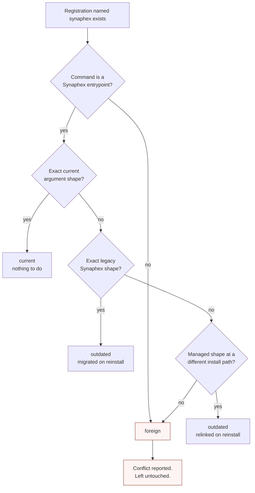

# Troubleshooting: installation

Problems installing Synaphex or registering it with a provider MCP host.

## Troubleshooting index

- **Installation**
- [Providers and agent execution](providers.md)
- [Sessions and locks](sessions-and-locks.md)
- [CODER and change sets](coder-and-change-sets.md)

## Symptom index

| Symptom | Jump to |
| --- | --- |
| `synaphex: command not found` | [Command not found](#command-not-found) |
| Installer says a provider runtime was not found | [Provider runtime not detected](#provider-runtime-not-detected) |
| Installer reports a version below the minimum | [Version below minimum](#version-below-minimum) |
| "A registration named synaphex already exists" | [Foreign registration conflict](#foreign-registration-conflict) |
| Host still starts Synaphex with `--host-surface` | [Legacy registration](#legacy-registration) |
| Some providers registered, others failed | [Partial install](#partial-install) |
| Install refuses because a config file is invalid | [Invalid config blocks install](#invalid-config-blocks-install) |
| Ran `synaphex uninstall`, command still exists | [Uninstall confusion](#uninstall-confusion) |
| `~/.synaphex` still exists after uninstall | [Uninstall confusion](#uninstall-confusion) |

## Command not found

**Symptom.** `synaphex install` reports `command not found`.

**Likely cause.** Either the package is not installed globally, or your shell cannot see npm's global bin directory.

**How to confirm.** These are two different problems, so check which one you have:

```bash
npm list -g synaphex        # is the package installed?
npm bin -g                  # where does npm put global executables?
echo "$PATH"                # is that directory on your PATH?
```

**Safe next step.** If `npm list -g` does not show it, install it. If it *is* listed but the command is not found, the global bin directory is missing from your `PATH` — add it in your shell profile.

**What not to do.** Don't try `synaphex --version` to test the install — that flag does not exist and will just print usage. Use `npm list -g synaphex` instead.

**Related.** [CLI reference](../reference/cli.md), [installation guide](../getting-started/installation.md).

## Provider runtime not detected

**Symptom.** The installer reports that a provider runtime was not found, and skips it.

**Likely cause.** That provider's CLI is not installed, or not on the `PATH` of the shell you ran `synaphex install` from.

**How to confirm.** Ask each runtime directly:

```bash
codex --version     # OpenAI / Codex
claude --version    # Anthropic / Claude Code
agy --version       # Google / Antigravity
```

**Safe next step.** Install the missing runtime using **that provider's own instructions**, then re-run `synaphex install`.

> **Synaphex never installs provider software.** It runs no package manager, no `curl` installer, and no extension install. A missing runtime is reported, not fixed.

**Related.** [OpenAI Codex](../providers/openai-codex.md), [Anthropic Claude](../providers/anthropic-claude.md), [Google Antigravity](../providers/google-antigravity.md).

## Version below minimum

**Symptom.** The runtime is found, but the installer reports the version is unsupported.

**Likely cause.** Registration minimums are the versions whose official MCP command syntax was verified directly:

| Runtime | Registration minimum |
| --- | --- |
| `codex` | 0.153.0 |
| `claude` | 2.1.260 |
| `agy` | 1.1.26 |

**How to confirm.** Compare `<runtime> --version` against the table.

**Safe next step.** Upgrade that runtime through its own update mechanism, then re-run `synaphex install`.

> **Hosting and executing are different requirements.** The versions above let a runtime *host* Synaphex over MCP. Running an agent *on* a provider is a separate check: Claude requires **2.1.248** to execute agents, while Codex has no execution version floor (a successful `--version` is enough) and Antigravity is probed for capabilities rather than a version.

So a runtime can be new enough to execute agents but too old to register, or the reverse. The installer tells you which check failed.

**Related.** [Compatibility](../reference/compatibility.md).

## Foreign registration conflict

**Symptom.** Install fails reporting a conflicting registration named `synaphex`.

**Likely cause.** A registration under that name exists which Synaphex cannot prove it wrote.

**How Synaphex classifies it.** The installer inspects the registered command and arguments:



| Classification | What install does |
| --- | --- |
| `current` | Nothing — already correct |
| `outdated` (legacy args, or a different Synaphex install path) | Replaces it with the current registration |
| `foreign` | **Refuses and leaves it alone** |

**Safe next step.** Find out what owns that entry before touching it — inspect it with the provider's own MCP listing command (`codex mcp list`, `claude mcp get synaphex`, `agy mcp list`). If it is genuinely yours and you no longer want it, remove it with that provider's own command, then re-run `synaphex install`.

**What not to do.** Don't delete the entry reflexively. Synaphex refuses precisely because it cannot prove the entry is safe to overwrite — something else may depend on it.

## Legacy registration

**Symptom.** A host launches Synaphex and it exits reporting that `--host-surface` is not accepted.

**Likely cause.** The registration was written by an older Synaphex that asserted a host surface. That flag was removed; it is now **rejected outright** rather than ignored, so a stale registration fails loudly instead of running under a wrong assumption.

**Safe next step.** Run `synaphex install`. The installer recognizes that exact legacy shape as Synaphex-owned and migrates it to the provider-only form.

**What not to do.** Don't hand-edit the provider's MCP config. The supported migration path is a reinstall.

## Partial install

**Symptom.** The report shows some providers registered and others failed.

**Likely cause.** Providers are registered independently — a missing runtime, a version failure, or a conflict on one does not stop the others.

**How to confirm.** Read the per-provider outcomes in the summary. The installer reports exactly what happened per target and does not claim overall success when part of it failed.

**Safe next step.** Fix the specific cause for the failed provider, then re-run `synaphex install`. Re-running is safe: an already-correct registration is classified `current` and left alone.

> **There is no transactional rollback.** Successful registrations from a partially failed run **remain in place**. That is deliberate — undoing work that succeeded would leave you with less than you had.

## Invalid config blocks install

**Symptom.** Install fails naming a file and field in `~/.synaphex`.

**Likely cause.** One of `agent_config.jsonc`, `agent_behavior.jsonc`, or `rules.jsonc` has invalid JSONC, an unknown field, or an invalid value.

**How to confirm.** The error names the file and the offending field.

**Safe next step.** Open that file, fix the reported value, and re-run install. Your configuration is preserved: the lifecycle **fails closed and leaves the original bytes untouched** rather than rewriting a file it could not parse.

**What not to do.** Don't delete the file to "regenerate" it unless you actually want to discard your configured values. Deleting is a way to lose your agent targets and rules, not a repair.

**Related.** [Configuration overview](../configuration/overview.md), [agent config](../configuration/agent-config.md), [rules](../configuration/rules.md).

## Uninstall confusion

Two different removals exist, and they do different things.

| Command | Removes |
| --- | --- |
| `synaphex uninstall` | Synaphex-owned MCP registrations from providers |
| `npm uninstall -g synaphex` | The npm package and its executables |

### "I ran `synaphex uninstall` but the command still exists"

**Expected.** Product uninstall removes MCP registrations, not the package. Remove the package separately if you want the command gone.

### "I removed the npm package but the registration is still there"

The registration points at a launcher that no longer exists, so the host will fail to start Synaphex.

**Safe sequence:** run `synaphex uninstall` **first**, then `npm uninstall -g synaphex`. If the package is already gone, reinstall it, run `synaphex uninstall`, then remove it — or remove the entry with the provider's own MCP command.

### "`~/.synaphex` still exists"

**Expected, and deliberate.** It holds your durable project and task history — plans, artifacts, memory, change sets. Uninstall never deletes it.

It contains **no provider credentials**. If you want that history gone, remove the directory yourself, understanding it is not recoverable.

**Related.** [Filesystem layout](../reference/filesystem-layout.md).

## Sharing diagnostics safely

When posting installer output, avoid including tokens or API keys, your full environment, or personal absolute paths where a placeholder would do. Provider output sanitization is best-effort, not a guarantee.
