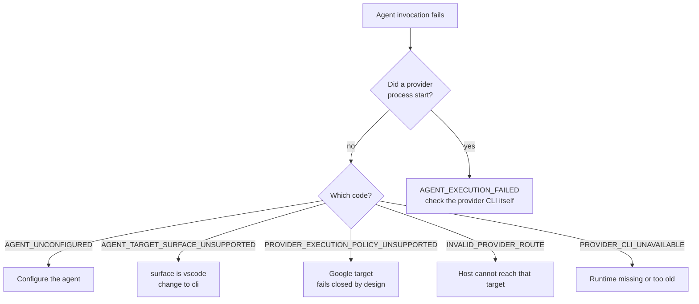

# Troubleshooting: providers and agent execution

Synaphex appears in your host, but an agent will not run — or runs and fails.

## Troubleshooting index

- [Installation](installation.md)
- **Providers and agent execution**
- [Sessions and locks](sessions-and-locks.md)
- [CODER and change sets](coder-and-change-sets.md)

## Start here: host or target?

The single most useful distinction. **Being able to host Synaphex says nothing about being able to run an agent on that provider.**

| What you observe | What it tells you | Where the problem is |
| --- | --- | --- |
| Synaphex tools appear in your provider UI | MCP hosting works | Not a hosting problem |
| Invocation fails immediately, no provider process starts | Routing, target, policy, or config | Configuration — see below |
| A provider process starts, then fails | Provider runtime, auth, or model | The provider's own setup |



## Unsupported VS Code target

**Symptom.** Invocation fails with `AGENT_TARGET_SURFACE_UNSUPPORTED`.

**Likely cause.** The agent is configured with `"surface": "vscode"`:

```jsonc
{ "provider": "anthropic", "surface": "vscode", "model": "..." }
```

**Safe next step.** Change that agent to a CLI target:

```jsonc
{ "provider": "anthropic", "surface": "cli", "model": "..." }
```

VS Code can *host* Synaphex — providers share one MCP registration between their CLI and VS Code surfaces — but a VS Code extension is an interactive surface, not a callable agent target. The refusal happens before routing; no provider process starts and your configuration is never silently rewritten.

> Switching to `cli` does **not** make the agent reuse your open VS Code panel. It runs a separate provider CLI process.

**Related.** [Agent config](../configuration/agent-config.md), [compatibility](../reference/compatibility.md).

## "I'm in VS Code — why did another CLI process run?"

**Expected behavior, not a bug.**

When your host is OpenAI or Anthropic and the target is a same-provider `cli` agent, the flow is:

```text
VS Code (shared MCP registration) → Synaphex → separate provider CLI process
```

Synaphex does not reuse your current extension conversation, context, or session. Every agent invocation is its own provider process with its own instruction.

## Google / Antigravity target refuses to run

**Symptom.** A `google` / `cli` agent fails with `PROVIDER_EXECUTION_POLICY_UNSUPPORTED`.

**Likely cause.** This is intended, permanent v0.1 behavior — not a misconfiguration and not a missing runtime.

**Why.** Synaphex asks the provider to enforce an execution policy *for one invocation* — what the agent may modify, whether it may reach the network. Antigravity exposes tool-execution policy, file access, and permission grants only as **persistent global or project settings**. Synaphex will not mutate provider-owned settings, so it cannot establish that contract per invocation, and it refuses rather than claiming a guarantee it cannot deliver.

This applies to **every** agent: read-only roles need a `read_only` contract and CODER needs `workspace_write`; neither is enforceable per invocation.

**Safe next step.** Use Google/Antigravity as an **MCP host** — that is fully supported — and configure agent targets on OpenAI or Anthropic.

**What not to do.** Don't loosen your Antigravity permission settings to try to force execution. That would not change the refusal, and it would weaken protections in your provider that Synaphex is not able to see or manage.

**Related.** [Google Antigravity](../providers/google-antigravity.md), [compatibility](../reference/compatibility.md#google--antigravity).

## Provider authentication problems

**Symptom.** A provider process starts and then fails with an auth-shaped error.

**Likely cause.** That provider CLI is not authenticated, or its session expired.

**How to confirm.** Run the provider's CLI directly with a trivial prompt. If it fails there, it will fail under Synaphex.

**Safe next step.** Fix authentication using **that provider's own login flow**, then retry.

> **Synaphex stores no credentials.** There is no `apiKey` field in any Synaphex config file, and adding one does nothing. Never put tokens in `agent_config.jsonc`, `rules.jsonc`, or `agent_behavior.jsonc`.

**Related.** [Credentials and auth](../security/credentials-and-auth.md).

## Environment and auth confusion

Provider CLI processes launched by Synaphex **inherit its full environment**. That is deliberate — provider authentication frequently lives in environment variables or in state reachable through `HOME`, and overriding it would break cached and subscription logins.

Two practical consequences:

- If a provider behaves differently under Synaphex than in your terminal, compare the environment your MCP host was launched from against your interactive shell. A variable present in one and not the other is the usual explanation.
- Synaphex does **not** scrub unrelated secrets from that environment. If your host was launched from a shell carrying unrelated tokens, provider CLIs can see them — the same exposure as running the provider CLI from that shell yourself.

When debugging, check variable **names and presence**, not values:

```bash
env | cut -d= -f1 | sort   # names only, no secrets printed
```

**What not to do.** Don't paste your environment, or any variable's value, into an issue or chat.

## Provider diagnostics look truncated

**Expected.** Before a provider stderr excerpt is surfaced, Synaphex strips ANSI sequences, redacts `Bearer` tokens and common `*_API_KEY` / `AUTH_TOKEN` / `ACCESS_TOKEN` patterns, and truncates to roughly the last 20 lines.

So the public error can carry **less detail than the provider's own output**. That is intentional.

> Redaction is best-effort pattern matching, **not a guarantee**. A secret in a shape the patterns do not match will not be redacted — treat provider diagnostics as potentially sensitive.

If you need deeper detail, run the provider CLI directly in your own environment where you control what is displayed and shared.

## Generic `AGENT_EXECUTION_FAILED`

**Symptom.** Invocation fails with `AGENT_EXECUTION_FAILED: Agent execution failed.`

**What it means.** A provider process ran and failed, and the underlying error was not one of the stable public codes. The message is deliberately generic because provider stderr can contain credentials.

**Likely areas.** Provider runtime failure, authentication, an unsupported model name, a provider timeout, or an unexpected adapter condition.

**How to confirm.** Reproduce outside Synaphex — same provider CLI, same model:

```bash
claude --version && codex --version
```

Then run a trivial prompt through that CLI directly. Most causes reproduce immediately.

**Safe next step.**

1. Verify the provider CLI works standalone.
2. Verify the agent's `provider`, `surface`, and `model` are what you intend — an invalid model name is a common cause.
3. Check the MCP server's stderr, where the precise reason is written.

**What not to do.** Don't assume this is a routing or policy problem. Those emit their own specific codes (`INVALID_PROVIDER_ROUTE`, `AGENT_TARGET_SURFACE_UNSUPPORTED`, `PROVIDER_EXECUTION_POLICY_UNSUPPORTED`). Seeing the generic code means the failure was *not* one of them.

**Related.** [Errors reference](../reference/errors.md).

## `INTERNAL_ERROR`

**What it means.** Synaphex hit an error it does not consider safe or stable to expose publicly. Known routing and policy refusals each have their own code and do **not** collapse to this.

**Safe next step.** Record the tool name and the operation you attempted, keep the public message, check the server's stderr for the precise reason, and try to reproduce with minimal state.

**What not to do.** Don't include credentials, a full environment dump, or private source when reporting it.

## Sharing diagnostics safely

Avoid posting tokens or API keys, full environment dumps, private source, `~/.synaphex` memory or artifacts, or personal absolute paths where a placeholder would do.
