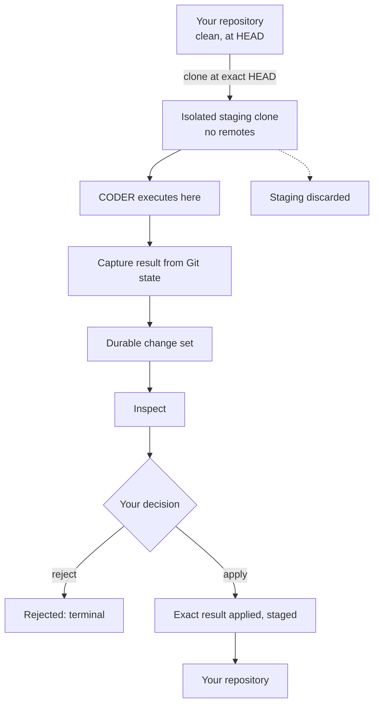
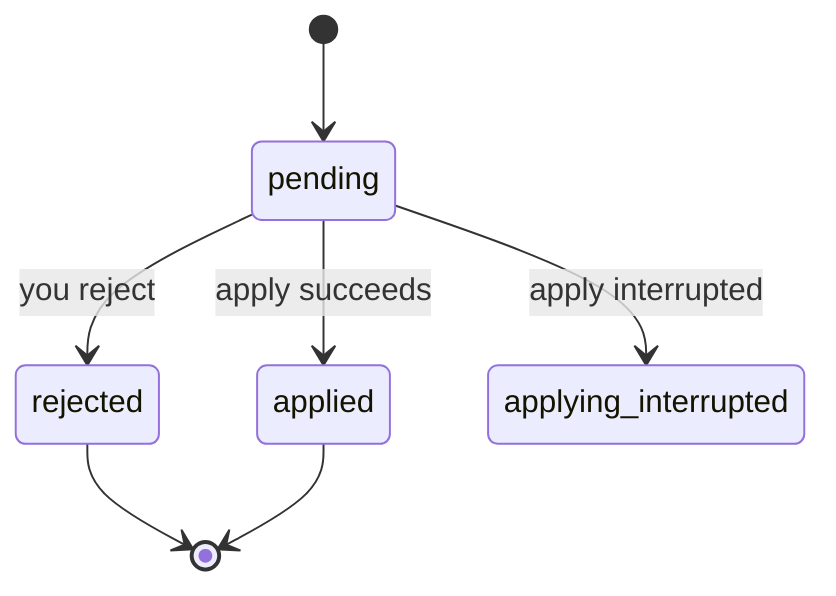

# CODER and change sets

> **CODER executes against isolated staging. Your repository changes only
> through an explicit change-set application.**

This page covers the full path from invoking CODER to your source actually
changing — the most safety-critical workflow in Synaphex.

## The full path



While CODER runs, your repository is untouched: `HEAD` has not moved, nothing is
staged, and no file has changed.

## Before CODER runs

Synaphex refuses to stage unless your source is in a state it can reproduce
exactly:

| Requirement | Why it matters |
| --- | --- |
| A real Git worktree with a committed `HEAD` | The change set is defined against an exact baseline |
| No staged, unstaged, or untracked changes | Your work would otherwise be mixed into the result |
| No submodule gitlinks | Materialising them could require external repositories |
| No symlinks escaping the worktree | A staged path could otherwise point outside the workspace |

A refusal here is a precondition failure, not an error in your work. Commit or
stash first, then invoke CODER again.

## The staging model

Synaphex creates a **local isolated Git clone** at your exact source `HEAD`,
with remotes removed, and projects that path to the provider as its workspace.
CODER sees a normal repository and works in it normally.

After capture, the staging workspace is discarded.

This is workspace isolation, not OS-level sandboxing. It is not a container, and
it is not a security boundary against a hostile provider — it is the mechanism
that keeps your repository unchanged and makes the result exactly reviewable.

## The change set

The result is captured from **Git state**, not from what the model said it did,
and stored as a durable change set: an immutable patch against an exact baseline
commit, with the list of files it touches.

A change set is authoritative only when it is the task's current CODER target. A
directory existing somewhere is not authority — an orphaned or superseded change
set cannot be applied.

## Inspecting

```text
synaphex_get_change_set          metadata: baseline, size, files changed
synaphex_read_change_set_patch   the exact patch bytes
```

> Show me the current Synaphex change set before I decide whether to apply it.

Metadata first, patch second, decide third. The file list comes from Git, so it
reflects what actually changed rather than what was claimed.

## Applying

```text
synaphex_apply_change_set   { sessionId, changeSetId }
```

Apply is exact, and refuses rather than improvising:

| Guarantee | Behaviour |
| --- | --- |
| Baseline | Your `HEAD` must still equal the captured base commit |
| Worktree | Must still be clean |
| Result | The exact reviewed result, verified after application |
| Merge | **Never.** No three-way merge, no rebase, no reconciliation |
| Commit | **Never.** Changes are left staged |
| Push | **Never** |

> **Applying a change set does not commit or push it.** The result is staged in
> your repository; committing is yours to do.

If your source moved since capture, apply **fails**. That is the intended
outcome: silently merging a reviewed change into a repository that has since
changed would produce something nobody reviewed.

When apply fails that way, either return your source to the recorded baseline,
or run CODER again from where you are now.

## Rejecting

```text
synaphex_reject_change_set   { sessionId, changeSetId }
```

Rejection is terminal for that change set. Your source is untouched, the
decision is recorded, and the patch is retained for the record but can never be
applied afterwards. Nothing re-runs CODER for you.

## Change-set states



`applying_interrupted` is rare and has its own workflow — see
[interrupted apply recovery](interrupted-apply-recovery.md).

## Running CODER again

A successful apply leaves your worktree **intentionally dirty**: the result is
staged. But CODER requires a *clean* worktree.

So a second CODER cycle after an apply needs you to settle Git state first —
typically by committing the applied work. Synaphex does not do this for you and
does not suggest a destructive command, because how you record your history is
your decision.

This is a known v0.1 limitation, and a direct consequence of two guarantees
worth keeping: CODER starts from an exact reproducible baseline, and Synaphex
never commits on your behalf.

## Next

- [Review, complete and archive](review-complete-archive.md)
- Advanced: [interrupted apply recovery](interrupted-apply-recovery.md)
- Previous: [planning and coding](planning-and-coding.md)
