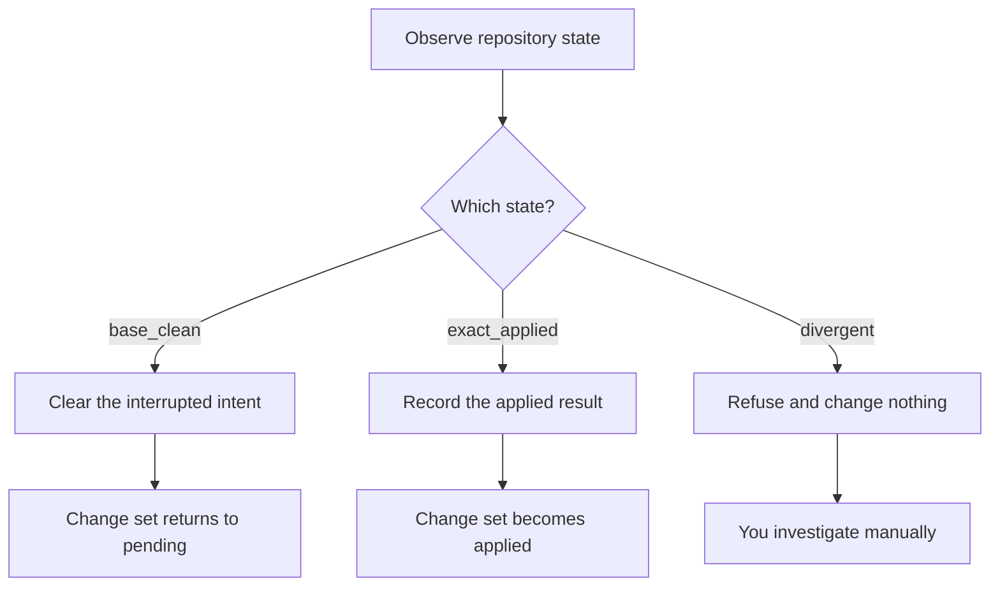

# Interrupted apply recovery

> This is an exceptional workflow, not part of normal use. A normal apply either
> succeeds or rolls back on its own.

Recovery exists for one narrow case: the process died *during* an apply, after
Synaphex had recorded that it was about to change your source. Applying a change
set is not atomic across a crash, so Synaphex records its intent first and can
therefore detect an interruption instead of guessing afterwards.

## The `applying_interrupted` state

A change set in this state means: an apply started, and Synaphex cannot confirm
from its own records how far it got.

> **Synaphex never resets or cleans your repository after an interruption.**
> Anything it found could be your work, and destroying it would be worse than
> asking.

Nothing recovers automatically on restart. Until you reconcile, the change set
cannot be applied, rejected, or completed past.

## Step 1: observe

```text
synaphex_get_apply_recovery_state   { sessionId, changeSetId }
```

Synaphex inspects your repository and compares it — by exact Git object identity
— against two known points: the baseline the change set was captured from, and
the exact result it would produce.

| Observation | What your repository matches | What it means |
| --- | --- | --- |
| `base_clean` | The original baseline, exactly | The change was not effectively applied |
| `exact_applied` | The intended result, exactly | The apply completed before the interruption |
| `divergent` | Neither, exactly | Synaphex cannot prove what happened |

"Exactly" is literal. A repository that matches the result but has one extra
untracked file is `divergent`, not `exact_applied`.

## Step 2: reconcile

```text
synaphex_reconcile_interrupted_apply   { sessionId, changeSetId }
```



| Observation | Outcome |
| --- | --- |
| `base_clean` | The interrupted intent is cleared and the change set returns to `pending`. You can apply or reject it normally. |
| `exact_applied` | The applied result is recorded and the change set becomes `applied`. Your source is **not** modified — it already holds the result. |
| `divergent` | **Nothing changes.** Reconciliation fails closed and your repository is untouched. |

> **Reconciliation proves state; it does not guess.** It only records what the
> repository demonstrably already is.

## Why divergent fails closed

Synaphex distinguishes two very different jobs:

```text
recovering its own coordination records    ← it will do this, when state proves the outcome
repairing your source                      ← it will never do this
```

A divergent repository could be a partial apply, a partial apply plus your own
edits, or work from another process. Synaphex cannot tell, and no rule it could
apply would be right in every case — so it stops.

## Resolving a divergent repository

This is a normal Git task, and it is yours:

1. Inspect what is actually in your repository.
2. Decide whether you want the change or not.
3. Bring the repository to **either** the exact baseline **or** the exact
   intended result.
4. Run `synaphex_get_apply_recovery_state` again to confirm, then reconcile.

Synaphex does not prescribe the Git commands, because the right ones depend on
what it found and what you want to keep.

## After reconciling

| Resulting state | What you can do next |
| --- | --- |
| `pending` | Apply or reject the change set as normal |
| `applied` | Invoke REVIEWER, then complete and archive |

## Next

- Previous: [review, complete and archive](review-complete-archive.md)
- Related: [CODER and change sets](coder-change-sets.md)
