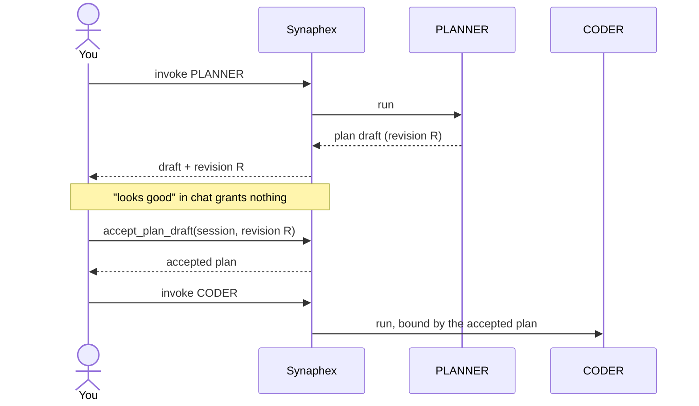
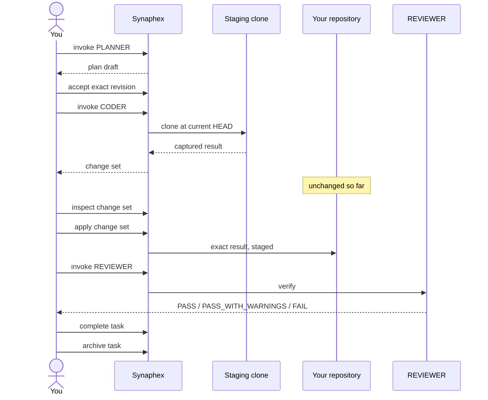

# Planning and coding

Three separate actions, each yours:

```text
PLANNER produces a plan.
You grant plan authority.
CODER implements.
```

Nothing chains them together. See [plans](../concepts/plans.md) for the
underlying model.

## The authority boundary



PLANNER never appears calling CODER — that edge is an immutable prohibition, not
a configurable rule.

> **Planning is optional. Plan authority is not.** You may skip PLANNER
> entirely, but you can never skip acceptance for a plan that exists.

## Planning

> Use Synaphex to invoke PLANNER for this task.

PLANNER returns a **plan draft**, which carries no authority. Read it back with
`synaphex_get_plan_state`, which returns the draft together with its revision
id.

## Accepting or rejecting

Acceptance takes the session **and the exact revision you reviewed**:

```text
synaphex_accept_plan_draft   { sessionId, draftRevisionId }
synaphex_reject_plan_draft   { sessionId, draftRevisionId }
```

Binding acceptance to a revision means a draft rewritten after you read it
cannot inherit your approval. A replacement draft is a new revision even when
its text is identical, because approval belongs to the exact draft you reviewed
— not to matching content.

## Running CODER

CODER behaves differently depending on plan state:

| Plan state | CODER behaviour |
| --- | --- |
| No plan, no draft | Implements within its role contract and your rules |
| **Pending draft** | **Blocked** |
| Accepted plan | The accepted plan is authoritative |
| Rejected draft | As if no plan existed |

> **A pending draft blocks CODER** (`PLAN_DRAFT_PENDING`). Accept or reject the
> draft first.

That block is deliberate. Without it, implementation could race a plan you had
not finished deciding, and neither result would be trustworthy.

### Without an accepted plan

If no draft is pending, you can invoke CODER directly. It implements without
plan authority — which is not the same as Synaphex acting autonomously. You
still invoked it, and you still decide what happens to its output.

### With an accepted plan

The accepted plan constrains the implementation. CODER cannot silently
reinterpret it.

When the plan turns out to be wrong, CODER may consult PLANNER for a restricted
set of purposes — plan clarification, implementation deviation, or plan
revision. That is a *request*, subject to your rules, and a revised plan needs
**fresh acceptance** before it carries authority.

## End to end



Every arrow from **You** is a decision. There is no step Synaphex takes on its
own.

## Next

- [CODER and change sets](coder-change-sets.md) — what happens inside that
  CODER step.
- Previous: [research workflow](research-workflow.md)
- Related: [plans](../concepts/plans.md)
