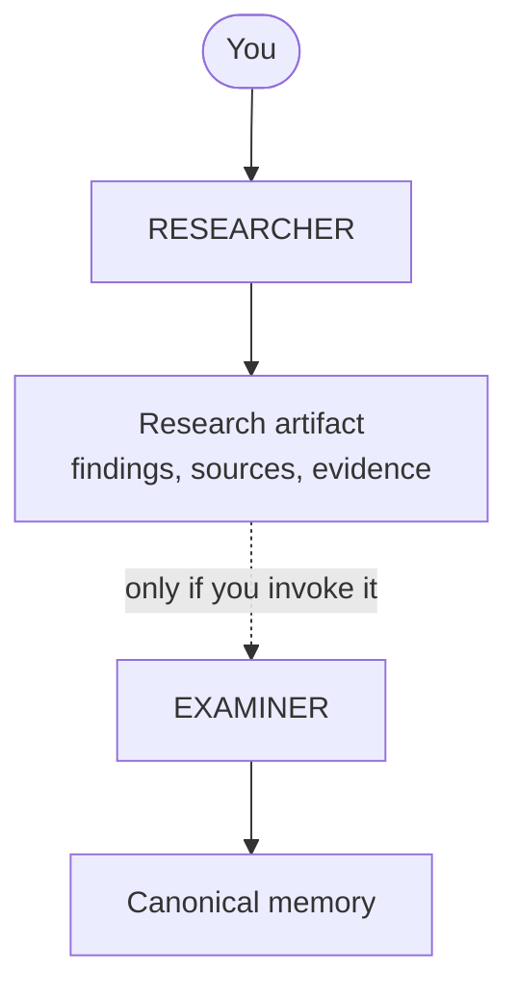

# Research workflow

Research gathers evidence. It does **not** update what the project knows.

Keeping those separate is the point of this workflow: a finding is something an
agent reported, while canonical memory is something the project has decided is
true. See [memory](../concepts/memory.md) for the underlying model.

## The flow

The dotted edge is the whole idea. Research does not become canonical memory on
its own — EXAMINER runs because you invoked it, or because a helper request was
permitted by your rules.

> Research produces evidence. Only EXAMINER curates canonical memory.

## Running research

Invoke `synaphex_invoke_agent` with `agent: "researcher"`:

> Use Synaphex to invoke RESEARCHER for this session and investigate how the
> config loader currently validates input.

You do not need EXAMINER to get research. If you only want an answer, invoking
RESEARCHER is the whole workflow.

## Choosing a scope

RESEARCHER runs at either scope:

| Scope | Open with | Use when |
| --- | --- | --- |
| Project | `synaphex_open_project_session` | The question is about the project generally — architecture, a dependency, comparing approaches |
| Task | `synaphex_open_task_session` | The research directly supports a specific piece of work |

Project-scoped research is not tied to any task, which makes it the right choice
for background investigation you expect to reuse.

## What you get back

A research artifact with these fields:

| Field | Contains |
| --- | --- |
| `findings` | What the research concluded |
| `sources` | Where the conclusions came from |
| `evidence` | Specific supporting detail |
| `uncertainties` | What remains unclear |
| `conflicts` | Contradictions the research encountered |
| `open_questions` | What still needs answering |

`uncertainties` and `conflicts` are worth reading before you act on `findings`.
An agent reporting a conflict is telling you the evidence disagreed, which is
usually more useful than the conclusion.

## Promoting research into memory

When a finding is worth keeping, invoke EXAMINER:

> Use Synaphex to invoke EXAMINER for this session and record what we learned
> about the config loader.

EXAMINER decides what becomes canonical. If the new information contradicts
existing canonical memory, it surfaces the conflict and **leaves the existing
memory in place** rather than overwriting it. You resolve the disagreement.

## Research after completion

RESEARCHER and EXAMINER may both run against a **completed** task. That is
deliberate — understanding finished work is legitimate, and often happens after
the work itself is done.

Neither runs against an **archived** task. Archiving is terminal, and no agent
executes against an archived task.

| Task state | RESEARCHER / EXAMINER | CODER, PLANNER, QUESTIONER, REVIEWER |
| --- | --- | --- |
| `active` | Yes | Yes |
| `completed` | Yes | No |
| `archived` | No | No |

## Next

- [Planning and coding](planning-and-coding.md)
- Related: [memory](../concepts/memory.md), [agents](../concepts/agents.md)
