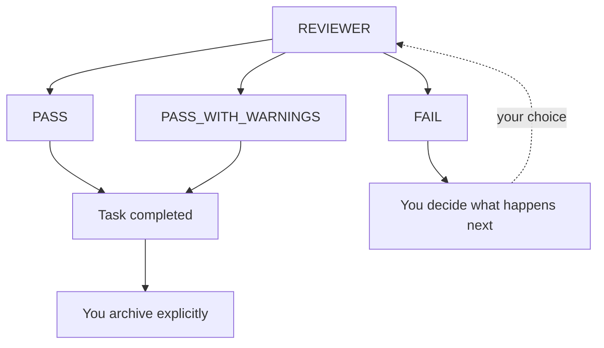

# Review, complete and archive

Closing out work has three stages, and they are separate operations.



## Reviewing

> Use Synaphex to invoke REVIEWER for this task.

REVIEWER verifies work that is actually in your source. It refuses when there is
nothing trustworthy to review:

| Situation | Why it refuses |
| --- | --- |
| No CODER work on the task | There is nothing to verify |
| Change set still `pending` | The work is not in your source yet |
| Change set was `rejected` | The work was deliberately discarded |
| Apply was interrupted | Source state is unresolved |
| Source changed after apply | It would review something never checked |

That last one matters most: if you edited or committed after applying, REVIEWER
refuses rather than reviewing a state nobody reviewed.

## Outcomes

| Verdict | Meaning | Fixes source? | Task effect |
| --- | --- | --- | --- |
| `PASS` | Acceptable | No | Completes the task |
| `PASS_WITH_WARNINGS` | Acceptable, with concerns recorded | No | Completes the task |
| `FAIL` | Not acceptable | No | No lifecycle change |

> **REVIEWER never fixes source, and a `FAIL` never invokes CODER.** After a
> failing review you decide: run CODER again, revise the plan, or stop.

Both passing verdicts complete the task as part of processing the review. A
`FAIL` leaves the task active.

## Completing manually

You do not need a review to finish work:

```text
synaphex_complete_task   { sessionId }
```

The session is the only authority — there is no task id, status, or force
parameter, so you cannot complete a task you do not currently own.

Completion is refused while something is still undecided:

| Blocker | Resolve by |
| --- | --- |
| A plan draft is pending | Accept or reject it |
| The latest change set is `pending` | Apply or reject it |
| The latest change set is `applying_interrupted` | [Reconcile it](interrupted-apply-recovery.md) |

A change set that is already `applied` or `rejected` does not block completion,
and neither does CODER work that changed nothing.

Completion **retains** your session and task ownership.

### Work still running when a task completes

If an agent is still running when the task becomes completed, its result cannot
commit unless its role permits a completed task. The check happens where results
are written, not only before execution starts.

In practice: a CODER or PLANNER result arriving after completion is refused,
while RESEARCHER and EXAMINER results are not — their role contracts permit
completed tasks.

## Archiving

```text
synaphex_archive_task   { projectId, taskId }
```

Archiving is addressed by project and task rather than by session, so a
completed task whose session is long gone can still be archived.

It requires the task to be `completed` already, discovers and releases whatever
task session still owns it, and removes that task-session binding. Project
sessions are unaffected.

Everything is preserved: plans, artifacts, change sets, decisions, review
history, and memory. Archiving deletes nothing.

> **Archiving is terminal.** There is no reopen and no unarchive. Work that
> continues afterwards is a new task.

## Complete versus archive

| Property | Completed | Archived |
| --- | --- | --- |
| Work semantically finished | Yes | Yes |
| Task history preserved | Yes | Yes |
| Task session and ownership may remain | Yes | No |
| Agents may still run | Only RESEARCHER and EXAMINER | No |
| Reopen supported | No | No |

## Closing a session without archiving

```text
synaphex_close_session   { sessionId }
```

This releases your task ownership so the task can be picked up again later. It
is not a lifecycle transition — the task keeps whatever state it had.

## Next

- Advanced: [interrupted apply recovery](interrupted-apply-recovery.md)
- Previous: [CODER and change sets](coder-change-sets.md)
- Related: [projects, tasks and sessions](../concepts/projects-tasks-sessions.md)
